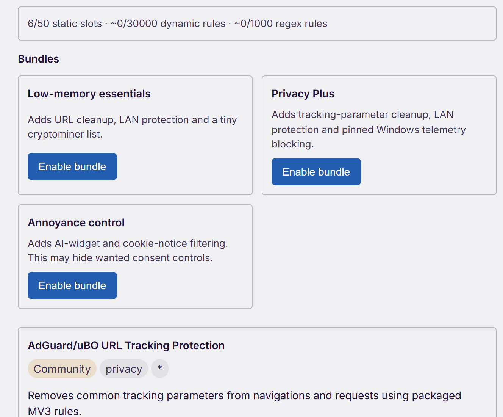
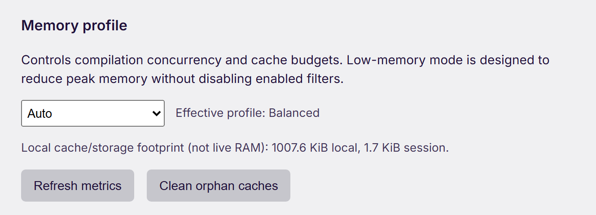
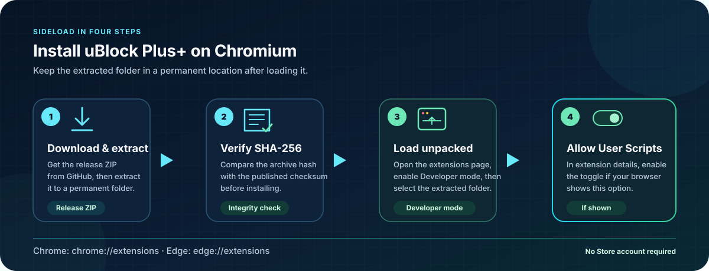

<div align="center">


<sub>Concept illustration · v1.0.0 is a manually updated sideload pre-release</sub>

# uBlock Plus+

### Community-powered content blocking, built for Chromium Manifest V3

**Sideload-first · Local-first · Open source · Made for user control**

[](https://github.com/kayurachann/uBlock-Plus/actions/workflows/mv3-chromium.yml)
[](https://github.com/kayurachann/uBlock-Plus/releases)
[](#quick-start)
[](docs/ARCHITECTURE.md)
[](LICENSE.txt)

[**Download v1.0.0 preview**](https://github.com/kayurachann/uBlock-Plus/releases/tag/v1.0.0) · [**Tiếng Việt**](docs/README.vi.md) · [Feature matrix](docs/FEATURE-MATRIX.md) · [Architecture](docs/ARCHITECTURE.md) · [Filter Store](docs/FILTER-STORE.md) · [Roadmap](docs/ROADMAP.md)

</div>

---

uBlock Plus+ is an independent, GPL-licensed content blocker for Chromium MV3. It combines a proven upstream filtering/compiler foundation with a community Filter Store, portable configuration, explicit power-user controls and memory-conscious operation—without a project telemetry service or remote executable code.

> [!IMPORTANT]
> **Release status:** v1.0.0 is a pre-release for manual sideloading and does not auto-update. uBlock Plus+ is not an official uBlock Origin or uBO Lite release and is not endorsed by Raymond Hill. Chrome MV3 does not expose every blocking primitive available to the original MV2 extension. Sideloading avoids Chrome Web Store distribution policy, but it does **not** remove DNR quotas, service-worker lifecycle rules or browser security boundaries. See the [honest compatibility matrix](docs/FEATURE-MATRIX.md).

## Built around your choices

<table>
<tr>
<td width="50%" valign="top">

### 🛡️ Layered content blocking

Static, dynamic and session DNR rules work alongside cosmetic filtering, packaged scriptlets, strict blocking and a context-aware Smart Popup Blocker.

</td>
<td width="50%" valign="top">

### 🧩 Community Filter Store

Explore the packaged community catalog or add up to eight compatible HTTPS repositories. Every remote list is treated as filter **data**, never executable extension code.

</td>
</tr>
<tr>
<td width="50%" valign="top">

### 🎯 Controls for every site

Choose per-site filtering modes, inspect matched-rule diagnostics and use the element picker, zapper or unpicker when a page needs a personal touch.

</td>
<td width="50%" valign="top">

### 🌱 Memory-conscious profiles

Choose `auto`, `balanced` or `low-memory`. Low-memory mode uses sequential compilation, bounded caches and safe cleanup without silently disabling enabled filters.

</td>
</tr>
<tr>
<td width="50%" valign="top">

### 📦 Your configuration, portable

Export and restore core settings, subscriptions, repositories, popup policies and custom filters. The built-in catalog is a starting point—not a lock-in mechanism.

</td>
<td width="50%" valign="top">

### 🔐 Privacy by design

Filtering and storage diagnostics stay local. There is no project analytics account, advertising SDK or browsing-history service; Chrome privacy controls require a separate, reversible permission.

</td>
</tr>
</table>

The complete Power UI string set is translated for English, German, Spanish, French, Japanese, Korean, Russian, Vietnamese, Simplified Chinese and Traditional Chinese. The other 61 packaged locales receive a deterministic English build fallback, so a new control never renders blank while community translation catches up.

<div align="center">

[Explore every capability →](docs/FEATURE-MATRIX.md)

</div>

## See it in action

<sub>Captured from the unpacked v1.0.0 artifact in a fresh Edge profile · no personal browsing data</sub>

<table>
<tr>
<td width="62%" valign="top">



<strong>Filter Store</strong><br>
Browse community entries, inspect quota impact and activate opinionated bundles explicitly.

</td>
<td width="38%" valign="top">



<strong>Memory Profile</strong><br>
Select Auto, Balanced or Low-memory and inspect local cache/storage—not live RAM—metrics.

</td>
</tr>
</table>

## Quick start

<div align="center">



</div>

### Install a release

1. Download `uBlock-Plus_*.chromium.zip` and its matching `.sha256` file from [GitHub Releases](https://github.com/kayurachann/uBlock-Plus/releases).
2. Verify the checksum, then extract the ZIP to a permanent folder.
3. Open `chrome://extensions` or `edge://extensions`.
4. Enable **Developer mode**, choose **Load unpacked**, and select the extracted folder containing `manifest.json`.
5. On Chrome 138+, open the extension's **Details** page and enable **Allow User Scripts**. Chrome 130–137 uses the global **Developer mode** switch instead. If you change either switch after installation, click **Reload** on the extension card so its service-worker context sees the new API state. This lets supported imported cosmetic filters and packaged allowlisted scriptlets register. See Chrome's [`userScripts` guidance](https://developer.chrome.com/docs/extensions/reference/api/userScripts).

> [!NOTE]
> A sideloaded extension does not update through the Chrome Web Store. Follow [Releases](https://github.com/kayurachann/uBlock-Plus/releases) and replace the unpacked build when a new version is published. Install only artifacts from this repository and verify the supplied SHA-256 checksum.

<details>
<summary><strong>Verify the release checksum on Windows</strong></summary>

```powershell
(Get-FileHash .\uBlock-Plus_1.0.0.chromium.zip -Algorithm SHA256).Hash
Get-Content .\uBlock-Plus_1.0.0.chromium.zip.sha256
```

The hexadecimal hashes must match (letter case does not matter).

</details>

### Build from source

Requirements: Chrome/Chromium or Edge 130+, Git with submodules, Node.js 22+ and network access for build-time filter data.

<details open>
<summary><strong>Windows / PowerShell</strong></summary>

```powershell
git clone --recurse-submodules https://github.com/kayurachann/uBlock-Plus.git
cd uBlock-Plus
$version = (Get-Content -Raw package.json | ConvertFrom-Json).version
.\tools\make-mv3.ps1 -Platform chromium -Version $version
```

</details>

<details>
<summary><strong>Linux / macOS</strong></summary>

```bash
git clone --recurse-submodules https://github.com/kayurachann/uBlock-Plus.git
cd uBlock-Plus
make mv3-chromium

# Optional: also create the versioned ZIP and SHA-256 file.
VERSION=$(node -p "require('./package.json').version")
tools/make-mv3.sh chromium "$VERSION"
```

</details>

Load `dist/build/uBlockPlus.chromium` from the browser's extensions page. The versioned PowerShell command and the optional versioned shell command create the ZIP and checksum under `dist/build/`; plain `make mv3-chromium` creates only the unpacked directory.

## How it fits together

<div align="center">


</div>

- Chrome DNR handles network filtering without waking the service worker for every request.
- The event-driven service worker manages settings, catalog state, migrations and recoverable rule updates.
- Imported lists compile locally into DNR and cosmetic data; scriptlets must already exist in the packaged allowlist.
- Offscreen compilation is temporary and closes after its work completes.

[Read the architecture](docs/ARCHITECTURE.md) · [Explore Power Runtime](docs/POWER-RUNTIME.md) · [Review the threat model](docs/THREAT-MODEL.md) · [Understand privacy](docs/PRIVACY.md)

## Security and trust boundaries

| Boundary | Project rule |
| --- | --- |
| Remote sources | HTTPS catalogs and lists are parsed as bounded data; redirects, malformed schemas and executable payloads are rejected. |
| Filter Store trust | Built-in and custom entries display their trust tier. Community popularity alone never upgrades an entry to `verified`. |
| Extension code | JavaScript, scriptlets and redirect resources ship inside the reviewed extension package—never from a runtime URL. |
| Permissions | Core filtering permissions are documented. Chrome's `privacy` permission is requested only when the user enables those controls and can be revoked. |
| Local data | Settings, compiled filters and storage-size diagnostics remain on the device unless the user explicitly exports them. |
| Release integrity | CI builds and validates the Chromium artifact; releases include a SHA-256 checksum. |

Security issues should be reported privately through [GitHub Security Advisories](https://github.com/kayurachann/uBlock-Plus/security/advisories/new), not a public issue. See [SECURITY.md](SECURITY.md) for the reporting policy.

## MV3: powerful, with honest limits

| Available today | Constrained by MV3 | Future research—optional |
| --- | --- | --- |
| DNR network blocking, cosmetic filtering, packaged scriptlets, custom/imported lists, Filter Store, picker/zapper, context-aware per-host popup policies and backup/restore | Live request logging, procedural filters, imported popup-filter enforcement, dynamic-firewall semantics, response-header operations and redirect behavior are only partially equivalent to MV2 | Managed Enterprise adapters and an independently installed open-source native companion, subject to RFC, consent and security review |

Arbitrary response-body rewriting, equivalent DNS/CNAME visibility and exact size-based response blocking are not available through the normal public MV3 extension APIs. Some MV2 filter syntax cannot be translated; consult the feature matrix before assuming equivalence. Imported network-list compilation now records stable rejection reasons and source line numbers; surfacing that report more richly in the dashboard remains roadmap work.

## Roadmap

<table>
<tr>
<th width="33%">Now</th>
<th width="33%">Next</th>
<th width="33%">Later</th>
</tr>
<tr>
<td valign="top">

- Harden the Power Edition
- Validate Filter Store workflows
- Exercise restart and rollback paths
- Establish low-memory baselines

</td>
<td valign="top">

- Safe rule deduplication and sharding
- Richer local diagnostics
- Accessibility and i18n polish
- Public performance regression reports

</td>
<td valign="top">

- Managed Enterprise adapter
- Optional native companion research
- Signed catalog provenance and revocation

</td>
</tr>
</table>

Roadmap items are not release promises. A feature ships only after implementation, tests, migration/rollback handling and security, privacy, license and performance review. [See the complete community roadmap →](docs/ROADMAP.md)

## Develop and contribute

```bash
npm ci
npm run lint
npm test
node tools/validate-mv3.mjs dist/build/uBlockPlus.chromium --release
```

Ideas and reports are welcome through the repository's structured issue forms:

- [Propose a feature or report a bug](https://github.com/kayurachann/uBlock-Plus/issues/new/choose)
- [Submit a Filter Store entry](https://github.com/kayurachann/uBlock-Plus/issues/new?template=filter_store_submission.yml)
- [Read the contribution guide](CONTRIBUTING.md)
- [Understand community governance](docs/COMMUNITY-GOVERNANCE.md)
- [Review module ownership and boundaries](docs/MODULE-PLAN.md)

The repository preserves upstream Git history and keeps [`gorhill/uBlock`](https://github.com/gorhill/uBlock) configured as a fetch-only `upstream` remote.

## Credits and license

uBlock Plus+ is a derivative work based on [uBlock Origin](https://github.com/gorhill/uBlock) and its MV3/uBO Lite implementation. Copyright, source headers, author history and third-party attributions are preserved. See [NOTICE.md](NOTICE.md).

Released under the [GNU General Public License v3.0 or later](LICENSE.txt).

<div align="center">

**Built in the open, shaped by its users.**

[Back to top ↑](#ublock-plus)

</div>
