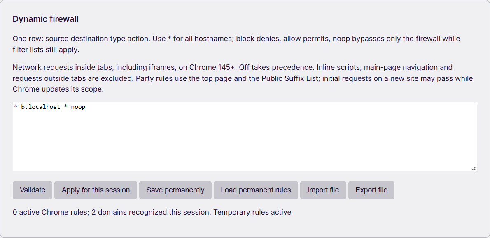
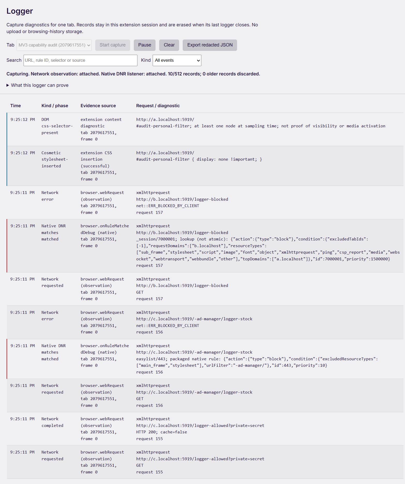

<div align="center">


# uBlock Plus+

**A community content blocker for Chromium Manifest V3**

[](https://github.com/kayurachann/uBlock-Plus/actions/workflows/mv3-chromium.yml) [](https://github.com/kayurachann/uBlock-Plus/releases) [](#quick-start) [](LICENSE.txt)

[**English**](README.md) · [Deutsch](docs/README.de.md) · [Español](docs/README.es.md) · [Français](docs/README.fr.md) · [日本語](docs/README.ja.md) · [한국어](docs/README.ko.md) · [Русский](docs/README.ru.md) · [Tiếng Việt](docs/README.vi.md) · [简体中文](docs/README.zh_CN.md) · [繁體中文](docs/README.zh_TW.md)

[Releases](https://github.com/kayurachann/uBlock-Plus/releases) · [Installation](#quick-start) · [User guide](#using-the-popup) · [Documentation](docs/README.md) · [Report a problem](https://github.com/kayurachann/uBlock-Plus/issues/new/choose)

</div>

uBlock Plus+ blocks unwanted network requests and page elements using Chromium's declarative filtering engine, cosmetic filters and packaged scriptlets. It builds on the filtering and MV3 components of [uBlock Origin](https://github.com/gorhill/uBlock), with a familiar site power button, custom filters, a community Filter Store and local backup/restore.

The **yellow plus** identifies this community fork. The shield turns gray when protection is off; the plus remains yellow. [Logo sources and rendering](docs/BRANDING.md).

> [!IMPORTANT]
> This is an independent community fork, not an official uBlock Origin or [uBlock Origin Lite](https://github.com/uBlockOrigin/uBOL-home) release, and it is not endorsed by Raymond Hill. Distribution is a **sideloaded pre-release**: install it once with Load unpacked, and the optional [Windows updater](docs/AUTO-UPDATE.md) installs later releases automatically. MV3 imposes browser limits; this project does not claim complete MV2 parity. The published preview and the latest source can differ—see [which build to install](#which-build-to-install).

## Contents

> [!TIP]
> **Installing in Chrome?** Download the newest Standard `uBlock-Plus_<version>.chromium.zip` and its `.sha256` file from [Releases](https://github.com/kayurachann/uBlock-Plus/releases), then follow [installation](#install-an-unpacked-build). On Windows, [set up automatic updates](#automatic-updates) once so that you never reinstall by hand. GitHub's **Code → Download ZIP**, **Source code (zip)** and **Source code (tar.gz)** contain development source, which must be built before loading into Chrome.

- [Features and screenshots](#features-and-screenshots)
- [Quick start, updates and removal](#quick-start)
- [Using the popup](#using-the-popup)
- [Filter lists and personal filters](#filter-lists-and-personal-filters)
- [Settings and backups](#settings-and-backups)
- [Permissions and privacy](#permissions-and-privacy)
- [What MV3 can and cannot do](#what-mv3-can-and-cannot-do)
- [Build and validate](#build-and-validate)
- [Troubleshooting](#troubleshooting)
- [Documentation and contributions](#documentation-and-contributions)
- [Credits and license](#credits-and-license)

## Features and screenshots

| Area | Available in this fork |
| --- | --- |
| Network filtering | Packaged static DNR lists, supported imported/custom rules, exceptions and packaged redirect resources. |
| Page filtering | Site-specific and generic cosmetic filtering, supported procedural filters and packaged scriptlets. |
| Site controls | Power Off/On with remembered filtering level, Basic/Optimal/Complete modes and hostname-scoped popup policies. |
| Element tools | Picker for persistent cosmetic filters, zapper for temporary removal and unpicker for saved matching filters. |
| Filter management | Built-in lists, HTTPS imports, Filter Store bundles and compatible community catalogs. |
| Settings | Protection profiles, themes, density, memory profiles, optional browser privacy controls and backup/restore. |
| Dynamic firewall | Source/destination/type rules with block, allow and true noop; DNS hostnames, IPv4 and bracketed IPv6; temporary/permanent rules, indexed lookup and an on-demand draft tester. Native enforcement requires Chrome 145+. |
| Filter exceptions | Cross-source scriptlet exceptions, exact imported/personal `$badfilter`, and source-mapped stock cancellation including proven hostname residual rules. |
| Diagnostics | Opt-in network, native DNR, cosmetic, DOM and scriptlet diagnostics with search and redacted export; bounded local history. |

See the [firewall, logger and exception guide](docs/MV3-PARITY-IMPLEMENTATION-2026-09-06.md) for usage, upgrade behavior and the remaining limits. In the standard edition, the optional `webRequest` permission is requested only when you start logger capture; network blocking uses DNR.

An optional [Experimental WebRequest package](docs/EXPERIMENTAL-WEBREQUEST.md) adds synchronous firewall blocking with a separate Chrome launcher/profile. The dashboard reports the actual permission and active state. It preserves DNR and Off/allow/noop behavior; it does not remove quotas or restore the complete uBO engine.

**Anti-adblock compatibility:** v1.1.1 adds six AdGuard-compatible redirect names for existing packaged resources, corrects conditional filters and entity/ancestor scriptlet exceptions, and rejects ambiguous source branches while preserving the last working configuration. A scoped Samplette filter disables its ad-detector polling while keeping track discovery usable. These changes use existing uBO resources and do not add a background page scanner. See the [research, Chrome regressions and real-site audit](docs/ANTI-ADBLOCK-2026-09-08.md) for measured results and remaining limits.

The screenshots below show the **actual unpacked extension in Google Chrome 152.0.7977.76 on Windows**, captured on 6 September 2026. They use isolated profiles and demonstration pages; they are not concept mockups. UI language in the screenshots is English. [Image provenance](docs/assets/readme/README.md).

<p align="center">

<br><strong>Site controls</strong><br>Power, filtering level and tools in one popup. Scroll to reach the footer when expanded.
</p>

<details>
<summary><strong>View the dark theme with fewer details</strong></summary>

<p align="center">

<br><strong>Fewer details</strong><br>Dark theme with details collapsed. More/Less changes the amount of information; density is a separate appearance setting.
</p>

</details>

<details>
<summary><strong>View the dynamic firewall and unified logger</strong></summary>



**Dynamic firewall:** edit uBO-style rules, validate the draft, then apply for this session or save permanently. A noop rule can generate no native rule while leaving static filtering active.


**Test and explain a rule:** enter the top page, destination and request type to inspect the winning draft cell, 1p/3p relationship and Off override. Testing sends no request and changes no protection setting. It explains hostname-cell policy, not all static filters or a native network outcome. See the [GitHub upgrade review, measurements and future priorities](docs/GITHUB-UPGRADES-2026-09-06.md).



**Unified logger:** start capture for a selected tab and distinguish observed network activity, native rule matches and DOM diagnostics. The example URLs and query values are synthetic test data; exported URLs are redacted.

</details>

## Quick start

### Which build to install

The manifest declares **Chromium 130 or newer**. The latest documented native-browser test is on Google Chrome 152; that result is not certification of every Chromium derivative or version. This repository's release pipeline targets Chromium MV3, not a Firefox or Safari package.

Releases that the [Release workflow](.github/workflows/release.yml) publishes (1.2.0 and later) are built by GitHub Actions from a tagged commit after tests, lint, both builds and their validators pass. They carry a SHA-256 file and a GitHub build-provenance attestation, which `gh attestation verify <zip> --repo kayurachann/uBlock-Plus` checks. Releases published before that workflow existed (1.1.2 and earlier) have a SHA-256 file only, no attestation, and no Windows updater. Download the standard `uBlock-Plus_<version>.chromium.zip` and its checksum from [GitHub Releases](https://github.com/kayurachann/uBlock-Plus/releases). The separate `experimental.chromium.zip` requires the [Experimental WebRequest setup](docs/EXPERIMENTAL-WEBREQUEST.md). Choose the newest preview on the Releases page; GitHub's `/releases/latest` endpoint excludes pre-releases.

For a CI build, open [MV3 Chromium Actions](https://github.com/kayurachann/uBlock-Plus/actions/workflows/mv3-chromium.yml), select a successful run for the desired commit, and download its `uBlock-Plus-chromium-<commit>` artifact. GitHub may require sign-in. Extract that outer artifact archive first to find the extension ZIP and matching checksum. CI artifacts are preview build outputs with limited retention; they do not update the public Release automatically.

### Install an unpacked build

Use the **Standard extension ZIP** above. A folder named `uBlock-Plus-main` commonly comes from GitHub's source download and cannot be loaded directly. The release ZIP has no outer folder: after extraction, the folder you chose should look like this:

```text
%LOCALAPPDATA%\uBlockPlus\Extension\
  manifest.json
  popup.html
  js\
  rulesets\
  updater\
```

Select that folder itself in Chrome. If your ZIP tool creates an extra outer folder, open it and select the inner folder that directly contains `manifest.json`. Do not copy an individual manifest out of the source tree: the complete compiled extension and its rulesets are required.

1. Obtain `uBlock-Plus_*.chromium.zip` and its matching `.sha256` file from this repository's Releases, a successful CI artifact, or a [source build](#build-and-validate).
2. Verify the checksum, then extract the ZIP into a **new, empty folder in your user profile** that holds nothing else. On Windows, use `%LOCALAPPDATA%\uBlockPlus\Extension`: type `%LOCALAPPDATA%` in the File Explorer address bar, create `uBlockPlus\Extension` there and extract the ZIP into `Extension`. In PowerShell, `Expand-Archive .\uBlock-Plus_<version>.chromium.zip "$env:LOCALAPPDATA\uBlockPlus\Extension"` does the same. Do not use a drive root, a folder you created directly under `C:\` or any folder inside it (such as `C:\Extensions` or `C:\Extensions\uBlock-Plus`), or Desktop, Documents or Downloads themselves: the [Windows updater](#automatic-updates) refuses them.
3. Open `chrome://extensions` in Chrome, or `edge://extensions` in Edge.
4. Turn on **Developer mode**, select **Load unpacked**, and choose the folder that directly contains `manifest.json`. `AppData` is hidden, so type `%LOCALAPPDATA%\uBlockPlus\Extension` in the dialog's address bar. Do not select the ZIP or its parent folder. Keep **Developer mode** on afterwards: Chrome turns unpacked extensions off without it.
5. Pin the extension from the browser's Extensions menu and open an ordinary HTTP/HTTPS page to try the popup.
6. For supported imported/user-script filters, enable the browser's user-script capability when required. On Chrome 138+, this is **Details → Allow User Scripts**. Chrome 130–137 uses **Developer mode**. After changing the switch, reload the extension so its worker sees the new API state. See the official [Chrome userScripts instructions](https://developer.chrome.com/docs/extensions/reference/api/userScripts).
7. On Windows, [set up the updater](#automatic-updates) once.

<details>
<summary><strong>Check the SHA-256 on Windows</strong></summary>

Run these commands in the download folder, adjusting the version if necessary:

```powershell
(Get-FileHash .\uBlock-Plus_1.2.0.chromium.zip -Algorithm SHA256).Hash
Get-Content .\uBlock-Plus_1.2.0.chromium.zip.sha256
```

The hexadecimal values must match; letter case does not matter. Compare against the checksum supplied with the **same build**.

</details>

### Automatic updates

The Chrome Web Store cannot update an unpacked extension, so uBlock Plus+ brings its own update channel. [AUTO-UPDATE.md](docs/AUTO-UPDATE.md) has the details, the troubleshooting table and the trust model.

**Every installation checks for new releases.** About every six hours the extension reads the public release list from `api.github.com`. It sends no browsing data and no identifier; GitHub sees your IP address and browser user agent, as with any request. A failed check is retried after 15 minutes, then at growing intervals up to one day. **Check now** works at most once a minute. When a newer version exists, the dashboard says so and the popup shows an **Update x.y.z** button that opens **Settings → Updates**. To turn checks off, clear **Check for new versions automatically** in **Dashboard → Settings → Updates**. Local builds made without a release version do not check. On macOS and Linux, the dashboard reports new versions and you update by hand, as described below.

**On Windows, the updater installs them for you.** Set it up once:

1. Install uBlock Plus+ 1.2.0 or later as described above, in `%LOCALAPPDATA%\uBlockPlus\Extension` or another new folder in your user profile. Earlier releases do not contain the updater.
2. In that folder, double-click `updater\install-updater.cmd`. It needs no administrator rights. It checks the folder, copies the updater to `%LOCALAPPDATA%\uBlockPlus\Updater`, registers it for Chrome (and for Edge, Chromium and Brave when they are installed) under your Windows account, and prints the folder, the extension ID and the browsers.
3. Open **Dashboard → Settings → Updates** and select **Allow the updater**. Chrome asks for permission to communicate with cooperating native applications; allow it. uBlock Plus+ then restarts once and reopens the Updates section. If it shows **Restart now** instead, select it.

Instead of downloading, extracting and running `install-updater.cmd` by hand, you can open PowerShell and run the commands below. They need no administrator rights; `-ExecutionPolicy Bypass` applies only to that one PowerShell process. The installer script and the updater files come from the `main` branch on `raw.githubusercontent.com`. The installer registers the updater, then downloads the newest release into `%LOCALAPPDATA%\uBlockPlus\Extension`, verifies it and extracts it. The folder must be missing or empty; if it already contains uBlock Plus+, only the updater is installed. If the download fails, the installer says so and keeps the registration; run it again. Then select the folder with **Load unpacked** and complete step 3.

```powershell
$installer = Join-Path $env:TEMP 'install-updater.ps1'
Invoke-WebRequest -UseBasicParsing https://raw.githubusercontent.com/kayurachann/uBlock-Plus/main/platform/mv3/updater/install-updater.ps1 -OutFile $installer
powershell -ExecutionPolicy Bypass -File $installer
```

From then on, each new release is:

* downloaded from GitHub Releases (`github.com`, which redirects the download to a `githubusercontent.com` host);
* checked against its published `.sha256` file, which must name that exact package, and against a release signature once signing is set up;
* checked for the same edition, the same extension identity and a newer version;
* copied over the folder, after the current version is backed up;
* followed by an automatic reload of the extension. Open extension pages close; websites keep their current filtering until you reload them.

Settings, filters and lists are kept, because the folder and extension ID stay the same. Choose **Only notify me** to install with **Install now** instead. **Restore version …** puts back the version saved before the last update; automatic installs then skip the version you left until a newer release appears or you select **Install now**. **Release channel** offers **Preview (includes pre-releases)** and **Stable releases only**; every release so far is a pre-release. Administrators can set the managed `autoUpdate` policy to `off` (no checks), `notify` (never install automatically) or `auto` (the user decides).

Release signing is not set up yet. The installer therefore shows `not configured (checksum only)` next to **Signed releases**, and packages are verified by their SHA-256 file. The installer pins the signing keys that ship with it; once keys are pinned, the updater also requires a valid signature from one of them. The updater never takes new keys or a new copy of itself from an unsigned package: run `updater\install-updater.cmd` again from the updated folder to pin keys or refresh the updater.

**Folder rules.** The updater changes only a folder that no other user of the PC can change. It refuses a drive root or a network path; system and profile folders themselves, such as Windows, Program Files, your user folder, Desktop, Documents or Downloads; folders that contain junctions or symbolic links; and folders that shared groups such as Everyone, Users or Authenticated Users can modify. This includes a folder created directly under `C:\` and every folder inside it, which every signed-in user may change. The installer runs the same check before it registers anything. The updater also refuses to update or restore while the folder contains files that the installed release did not list in `updater\package-files.json`, instead of deleting them: move those files out and try again. Chrome's `_metadata` folder and `Thumbs.db`, `desktop.ini` and `.DS_Store` files are left alone inside folders that the new release (or the backup, for a restore) also has; in a folder that the release drops, they count as unexpected files. Details: [folder rules](docs/AUTO-UPDATE.md#folder-rules) and [unexpected files](docs/AUTO-UPDATE.md#unexpected-files).

If you followed older advice and use a folder such as `C:\Extensions\uBlock-Plus`, you have two options:

* Move to the recommended folder. Chrome derives an unpacked extension's ID from its folder, so the moved copy is a new extension: export a backup first in **Dashboard → Settings**. If the updater manages the old folder, open Command Prompt and run `C:\Extensions\uBlock-Plus\updater\install-updater.cmd -Uninstall` (with your old folder). Remove the old copy, extract the release into `%LOCALAPPDATA%\uBlockPlus\Extension`, load it, restore the backup, run the setup from the new folder, then delete the old folder. See [moving an existing installation](docs/AUTO-UPDATE.md#moving-an-existing-installation).
* Keep the folder and remove the shared permissions from the top folder you created under `C:\` (here `C:\Extensions`). Run this once in Command Prompt (not PowerShell), then run `updater\install-updater.cmd` again. Afterwards only your account, SYSTEM and Administrators have access to that folder and everything in it.

  ```bat
  icacls C:\Extensions /inheritance:r /grant:r "%USERNAME%:(OI)(CI)F" *S-1-5-18:(OI)(CI)F *S-1-5-32-544:(OI)(CI)F
  ```

**If an update is interrupted** (a crash, a sign-out or a power cut), the updater restores the backup the next time it runs. The Updates section may first say “The previous update was interrupted before it finished.” If you open **Settings → Updates** before the next install, it reports that the interrupted update was undone, and uBlock Plus+ reloads into the restored version if needed. If an install runs first, it undoes the interrupted update and continues. If no backup is left, the section shows “The earlier version could not be restored. …”. Then run the updater with `-Rollback` on the [command line](docs/AUTO-UPDATE.md#command-line): it keeps the folder as it is, provided it still holds one of the two versions, and clears the interrupted update. The folder may still hold files of both versions, so then run the updater with `-Update`, or update by hand as described below ([details](docs/AUTO-UPDATE.md#interrupted-updates)).

**While filter lists update**, installing, restoring and the restart after **Allow the updater** wait up to a minute. If the filter-list update is still running, they stop with “A filter list update is running. Try again when it finishes.” An automatic install then tries again five minutes later; a manual action is not retried. Only one update or restore runs at a time, across browsers and the command line.

The updater also has a command line (`-Status`, `-Update`, `-Rollback`); see [AUTO-UPDATE.md](docs/AUTO-UPDATE.md#command-line).

Updating by hand still works everywhere. Export a backup from **Dashboard → Settings** and verify the new ZIP. Delete the old files in the extension folder, extract the new ZIP into the same folder, then click **Reload** on its extension card. Keep the folder path. Do not extract over the old files or place the new build one folder deeper: leftover files make the Windows updater refuse later updates. Reload websites to refresh already-injected scripts and cosmetic filters. **Details** on `chrome://extensions` must show the new version. If it does not, Chrome is loading another folder. Pushing source commits alone never changes an installed copy; only published releases do.

### Remove

To uninstall, optionally export a backup first, then select **Remove** on the browser's extensions page. Deleting the extension folder alone is not an uninstall. Reinstalling from a different folder can create a different unpacked extension identity; use your backup when migrating.

To remove the Windows updater as well, open Command Prompt and run `"%LOCALAPPDATA%\uBlockPlus\Extension\updater\install-updater.cmd" -Uninstall` (use your extension folder if it differs), before you delete that folder. While an update is running it stops with “An update is running; try again in a minute.” Otherwise it deletes the updater's backup, download and state for that folder. The browser registration (the updater's registry entries) and `%LOCALAPPDATA%\uBlockPlus\Updater` are removed only when no other installation remains registered with the updater. The extension folder is not changed.

## Using the popup

### Power and filtering modes

Click the large power button to turn protection Off for the current site's supported hostname scope. Click it again to restore the previous positive filtering level. The remembered level survives closing the popup and restarting the service worker.

| Mode | Behavior |
| --- | --- |
| Off / None | Disable filtering for that site scope. Reload to remove effects already applied to the page. |
| Basic | Network filtering; extended cosmetic/scriptlet filtering from packaged and imported lists is disabled. Personally authored sandbox and saved picker filters still apply on enabled sites. |
| Optimal | Network filtering plus site-specific cosmetic filtering and packaged scriptlets. |
| Complete | Optimal filtering plus generic cosmetic filtering. |

These levels select filtering behavior; choosing Basic does **not** revoke the manifest's existing `<all_urls>` permission. Global defaults are configured in the dashboard, while site exceptions take precedence where supported. A child-site override that cannot safely be represented returns an error instead of silently changing its parent or siblings.

Use **Reload** after changing protection. **More/Less** expands or collapses popup details; it does not change filtering. The popup supports keyboard Tab/Enter, and focus returns to the initiating control after a successful asynchronous change. Browser settings, extension pages and other restricted pages show unavailable tools.

### Popup policies

The popup policy applies to the **exact hostname**. It controls the contextual popup policy alongside filter-list rules and trusted-site settings.

The v1.1.2 popup update addresses slow trusted windows, separate rapid clicks, real form destinations and disabling protection during pending decisions. See the [popup blocker audit and Chrome methodology](docs/POPUP-BLOCKER-2026-09-08.md). Popup suppression by Chrome itself is measured separately from extension closures.

| Policy | Meaning |
| --- | --- |
| Default (Smart) | Follow the configured default contextual policy. |
| Allow | Allow through the contextual policy. **Matching compiled filter-list rules can still block.** |
| Smart | Consider opener, destination, trusted interaction and popup bursts. Missing information is handled conservatively. |
| Strict | Require a trusted user action and a directly related hostname. A legitimate cross-site sign-in or payment window may need a different policy. |

Site protection Off takes precedence. Recent popup counts refer to successful closures for the displayed site, not all browser requests. MV3 observation is asynchronous, so a target may begin opening before an eligible rule closes it. [Popup behavior and guarantees](docs/MV3-POPUP-PARITY.md).

### Picker, zapper and unpicker

- **Picker:** select an element and create a persistent cosmetic filter; review the selection before saving.
- **Zapper:** remove an element from the current page temporarily. Reloading restores it.
- **Unpicker:** remove a saved custom filter matching a selected element; it is available when matching personal filters exist.
- **My filters / Site rules:** open the relevant dashboard pane directly, including when the dashboard is already open.

## Filter lists and personal filters

### Built-in lists and HTTPS imports

Open **Dashboard → Filter lists** to review enabled lists and add supported HTTPS subscriptions. The build packages upstream filter data into static rulesets. Imported lists are fetched and compiled locally into the supported MV3 subset; enabling more lists consumes browser rule budgets and can introduce overlapping rules or site breakage.

Start with the default selection and enable additional regional or specialized lists for a concrete need. Use a direct HTTPS list URL: redirects, invalid schemas and oversized or unsupported input can be rejected. A list's availability does not guarantee every MV2 filter in it can be implemented. If a replacement cannot be activated safely, the existing active rules are retained where the operation supports recovery.


### Filter Store

The **Filter Store** is a catalog of filter lists, not an extension or executable-code store. It contains packaged community entries and bundles, and accepts up to eight compatible HTTPS JSON catalogs. A catalog URL is different from a raw filter-list URL.

Inspect each entry's purpose, source, license and trust label before enabling it. `community` is not a project endorsement; a digest proves a specific data snapshot, not the quality of its filters. Custom catalogs remain community entries. See [catalog format and review rules](docs/FILTER-STORE.md).


### My filters

The cosmetic filter section organizes saved selectors by hostname and supports text import/export. For example, a site-specific selector can hide a repeated sponsored card:

```text
example.com##.sponsored-card
```

This is an illustrative rule, not a list recommendation. Use the picker to choose a real element on the target page. The separate user-filter editor accepts supported filter syntax and requires the appropriate browser capability for user-script filters. It does not make arbitrary MV2 syntax or remote JavaScript executable under MV3.


## Settings and backups

**Protection profiles** and **memory profiles** are different settings:

| Setting | Options | Purpose |
| --- | --- | --- |
| Protection profile | Baseline, Balanced, Maximum, Low memory | Apply a group of filtering and runtime preferences. Review the selected settings after switching. |
| Filtering level | Basic, Optimal, Complete; Off for exceptions | Choose what filtering applies globally or to a site. |
| Memory profile | Auto, Balanced, Low memory | Control compilation and per-frame cosmetic loading concurrency, cache budgets and cleanup. |
| Appearance | Theme, accent, density, popup details | Adjust presentation without changing the matching rules. |

> [!NOTE]
> Storage diagnostics measure extension storage/cache usage, **not live RAM or process memory**. Low memory limits each frame to one cosmetic dictionary read at a time; Balanced allows two. Enabled filters and exceptions stay active. An uncached cosmetic lookup can take longer with smaller batches.

For a machine with limited memory, select **Settings → Memory profile → Auto** (uses Low memory for a browser memory hint of 4 GiB or less) or choose **Low memory** explicitly. This resource setting keeps your protection level and selected lists. See the [performance review and reproducible Chrome measurements](docs/PERFORMANCE-2026-09-06.md), informed by full uBO, AdGuard and Ghostery. Physical 2–4 GiB hardware and whole-browser RAM savings remain unmeasured.

Use **Dashboard → Settings** to export a backup before changing builds or resetting the extension. Restore validates supported configuration and includes filtering settings, remembered site levels, popup policies, personal filters and list/catalog configuration. Keep backup files private: they can reveal site names, custom rules and subscription URLs.

Restore is sequential rather than one global transaction. Invalid input fails validation, but a late browser or storage failure may leave earlier settings restored. Check the displayed result and your enabled lists afterward. **Reset to default settings…** returns settings to defaults and clears imported-list state; it is not a substitute for making a backup.


## Permissions and privacy

Filtering and diagnostic storage are local. The extension includes no project analytics, advertising SDK or browsing-history upload service. It does make network requests to filter/catalog providers for selected sources; those providers have their own privacy policies. Update checks read the public release list from `api.github.com` about every six hours without identifiers or browsing data, and can be turned off. Opening a support/report link can also contact an external site.

| Permission or capability | Why it is used |
| --- | --- |
| `<all_urls>`, `scripting`, `activeTab` | Apply site filtering, packaged scripts and user-invoked element tools on supported pages. |
| `declarativeNetRequest` | Ask Chrome to block, allow, redirect or modify requests using declared rules. |
| `declarativeNetRequestFeedback` | Provide limited matched-rule diagnostics in supported unpacked/debug contexts. |
| `storage`, `unlimitedStorage` | Save settings and compiled filter data locally. |
| `alarms`, `offscreen` | Schedule maintenance and perform temporary background compilation. |
| `userScripts` | Register supported user/imported filters using packaged code, subject to Chrome's separate switch. |
| `webNavigation` | Correlate navigation and popup context. |
| Optional `webRequest` | Observe requests for explicitly captured logger tabs; it does not add a blocking engine. |
| Optional `privacy` | Change selected Chrome privacy settings after the user enables those controls; disabling a control clears the extension's override. |
| Optional `nativeMessaging` | Talk to the separately installed Windows updater after you select **Allow the updater**. Each message holds only the protocol version, a command (`hello`, `stage`, `apply` or `rollback`), a request ID and, for an install, the release version number. No browsing data is sent. The updater downloads, verifies and installs the package itself. |

Current unpacked builds, including versioned packages, declare `declarativeNetRequestFeedback`. The unified logger works independently of the extension's own **Developer mode**; its native rule-match feed still depends on Chrome's API and installation eligibility. Start capture before reproducing a problem. Stock matches can resolve to packaged native rules, while dynamic/session bodies are separate, non-atomic API lookups; neither reconstructs every original filter expression. Missing feedback does not mean filtering is off. Popup diagnostics remain bounded and redact detailed URLs. See [privacy and retention](docs/PRIVACY.md) and the [threat model](docs/THREAT-MODEL.md).

## What MV3 can and cannot do

Userscripts can extend DOM and page-level JavaScript filtering, but do not grant browser network privileges or remove DNR quotas. This fork already uses `chrome.userScripts`. See the [userscript research and upstream issue review](docs/USERSCRIPTS-AND-MV3-2026-09-06.md) for specific improvements, regression coverage and the separate managed-engine option.

| Capability | Current boundary |
| --- | --- |
| Network blocking and exceptions | Available through DNR, within Chrome's supported conditions and quotas. |
| Cosmetic filters and scriptlets | Supported subset; scriptlet code and redirect resources must be packaged with the extension. |
| Popup/popunder filters | The supported stock `$popup` corpus and imported `$popup`/`$popunder` subset run through the contextual observer. Stock `$popunder` is explicitly omitted where export loses its original kind. |
| Dynamic firewall and request logger | Native network firewall with true noop on Chrome 145+; opt-in bounded logger. New-site party scope can require an asynchronous update; main-frame/inline-script rules and complete browser-wide logging remain outside this implementation. |
| `$badfilter` and scriptlet exceptions | Exact cancellation before imported/personal rule merging; stock supports whole-rule cancellation and rebuilding proven hostname block groups after partial cancellation. Unproven or secondary-corpus contributions remain active with warnings. Shared scriptlet exceptions with a conservative fallback when userScripts cannot carry the required data. |
| Response-body rewriting, DNS/CNAME inspection, exact response-size blocking | No equivalent implementation through this build's normal public MV3 APIs. |
| Managed settings and additional engines | Supported administrator settings are available; a managed blocking adapter and a filtering native companion remain research items. The only native component is the optional Windows updater, which runs only after you install it yourself; nothing native is installed silently. |

Chrome can reject an allow-exception regex because its compiled RE2 program exceeds the browser's limit. Some packaged lists contain such expressions, so a list-selection change can be rejected even when its rule count fits the quota. The extension restores the previous configuration and rules instead of dropping the exception. See the [native regex limit and recovery details](docs/MV3-PARITY-IMPLEMENTATION-2026-09-06.md).

**Fail-open is deliberate.** If a popup decision requires context that is missing or an exception cannot be represented safely, the relevant decision defers instead of approximating a block. When the matching work budget runs out, it defers only while an exception could still apply; otherwise the unevaluated block rules are skipped and the Smart/Strict policy decides. Deferred allow conditions can force deferral; they cannot manufacture an approximate allow/block decision. Unsupported restrictive rules are not broadened by stripping their conditions. This reduces false positives and also means some unwanted popups can pass.

Sideloading does not remove DNR quotas, restore a permanent MV2 background page or bypass browser security. Chromium, other installed blockers and the target site can also affect the result. See the [feature matrix](docs/FEATURE-MATRIX.md), [architecture](docs/ARCHITECTURE.md) and [Power Runtime](docs/POWER-RUNTIME.md) for exact boundaries.

## Build and validate

Use Git with submodules, Node.js and npm, with network access for build-time filter data. The Windows release workflow pins **Node 22.22.0 and npm 11.19.1**. The package declares Node 22+ and npm 11+; use the pinned versions to reproduce CI.

### Windows / PowerShell

```powershell
git clone --recurse-submodules https://github.com/kayurachann/uBlock-Plus.git
cd uBlock-Plus
git submodule update --init --recursive

# Windows blocks unsigned local scripts by default; allow them for this window only.
Set-ExecutionPolicy -Scope Process -ExecutionPolicy Bypass

npm ci
npm test
npm run lint
$version = (Get-Content -Raw package.json | ConvertFrom-Json).version
.\tools\make-mv3.ps1 -Platform chromium -Version $version
node tools/validate-mv3.mjs dist/build/uBlockPlus.chromium --release
```

Load `dist/build/uBlockPlus.chromium` from the browser's extensions page. The versioned command also creates `dist/build/uBlock-Plus_<version>.chromium.zip` and its `.sha256` sidecar. The folder contains `manifest.json`; the source repository root does not contain the installable build.

<details>
<summary><strong>Linux / macOS build entry points</strong></summary>

Use a shell environment with the prerequisites expected by the [MV3 build scripts](platform/mv3/README.md), including Bash, make, jq and ZIP/checksum utilities. The release pipeline and native Chrome evidence cited here were run on Windows.

```bash
git clone --recurse-submodules https://github.com/kayurachann/uBlock-Plus.git
cd uBlock-Plus
npm ci
npm test
npm run lint
VERSION=$(node -p "require('./package.json').version")
tools/make-mv3.sh chromium "$VERSION"
node tools/validate-mv3.mjs dist/build/uBlockPlus.chromium --release
```

`make mv3-chromium` is the alternative unpacked-build target. Supplying a version to the script produces the versioned ZIP and checksum.

</details>

### What has been tested

The [v1.1.2 popup blocker validation](docs/POPUP-BLOCKER-2026-09-08.md) passed **48 source test programs**, lint, both release builds/validators and **54/54 native Chrome popup cases per package**. The published v1.1.1 baseline passed 44/54 of the same behavioral assertions. Browser-native suppression is separated from extension closures; this is a controlled regression comparison, not an Internet-wide blocking percentage.

The [8 September anti-adblock release validation](docs/ANTI-ADBLOCK-2026-09-08.md) passed **47 source test programs**, lint, both release builds and validators, **11 native anti-adblock checks**, **27 firewall UI checks** and **24 network checks** on Chrome 152. The exact Standard/Experimental ZIPs contain **1,117/1,120 verified entries**. The native startup check caught six oversized stock allow regexes that left the stock dynamic group empty; scoped compatibility overrides restored **172 native stock rules**. The report documents the deliberate token-length relaxation, live website observations and remaining MV3 limits.

The earlier [indexed firewall and draft tester validation](docs/GITHUB-UPGRADES-2026-09-06.md#measurements-and-verification) passed 46 source test programs and includes **146,289 full-uBO action/provenance comparisons**. Its artifact hashes and counts remain recorded separately. The [firewall, logger and exception validation](docs/MV3-PARITY-IMPLEMENTATION-2026-09-06.md#xác-minh) records the preceding 41-program, 53-scenario run.

The [6 September 2026 local release validation](docs/MV3-CHROME-RETEST-2026-09-06.md) recorded:

- **31 source test programs**, lint, the versioned build and artifact validation passing.
- **28 visible Google Chrome scenarios**, covering popup controls, actual On/Off requests, IPv4/IPv6, element tools, site scopes, imports, backup/reset and worker restart.
- **7 additional Chrome scenarios** with sandbox and built-in popup blocking enabled, including real public-site block/redirect behavior.
- **976 ZIP entries** matching the unpacked build; 55 rulesets and 70,163 DNR rules in that specific artifact.

The subsequent [full-uBO capability audit](docs/MV3-CAPABILITY-AUDIT-2026-09-06.md) expanded the suite to **35 source test programs** and fixed further exception, scope, editor, diagnostics and compiler-cache defects. Its report records the separate artifact and Chrome results.

These are dated local results for the recorded builds, not a claim that the older published ZIP or every future commit passed those checks. The earlier native host-permission dismissal case was not exercised because that installation already had `<all_urls>`. The latest logger test exercised granting optional `webRequest`; declining that browser prompt is covered by source tests, not a recorded native prompt dismissal. Fixtures and one public-site probe are not a guarantee for every website, browser or assistive technology. Consult the live [Actions runs](https://github.com/kayurachann/uBlock-Plus/actions/workflows/mv3-chromium.yml) separately for CI status.

## Troubleshooting

| Symptom | What to check |
| --- | --- |
| Chrome cannot load the extension | Extract the ZIP, select the folder containing `manifest.json`, check browser version and read the extension card's error. |
| “Manifest file is missing or unreadable” after selecting `uBlock-Plus-main` | This usually means the GitHub source archive was downloaded. Download the Standard extension ZIP linked above, extract it, and select its folder containing `manifest.json`. See [installation](#install-an-unpacked-build). |
| A website breaks | Turn protection Off for that site and reload. If it recovers, inspect custom filters and recently enabled lists, then report a reproducible case. |
| A sign-in/payment popup closes | Review the exact hostname's policy and compiled filter rules. Allow changes the contextual policy only; temporarily turning site protection Off is a separate diagnostic step. |
| Picker or cosmetic changes seem inactive | Use a normal web page, check filtering mode and user-script capability, then reload the page. Restricted browser pages cannot be injected. |
| An imported list fails | Check its direct HTTPS URL, format, size, browser capability and available DNR budget. Read the error before retrying. |
| A child-site setting is rejected | Inspect the parent scope in Site rules; the extension refuses unsupported overrides instead of broadening them. |
| `Internal error while updating dynamic rules` in Windows testing | Retry in an isolated profile with a short path. This setup issue was reproduced during native Chrome validation; do not delete your personal profile to troubleshoot it. |
| Logger has no events | Choose the website tab and start capture before reproducing the request. Optional network permission and native DNR feedback are separate capabilities; see the logger status and Settings capability panel. |
| Old popup layout after updating | Confirm the loaded folder and version, reload the extension, then close and reopen the popup. Do not assume a previously published ZIP contains newer source fixes. |
| An automatic update does not install | Open **Settings → Updates** and read the message. Common causes: the extension folder is refused (move it into your user profile, see [folder rules](docs/AUTO-UPDATE.md#folder-rules)), the folder contains files that are not part of uBlock Plus+, the updater was installed for another folder (run the command shown there), or a filter-list update was still running. See the [update troubleshooting table](docs/AUTO-UPDATE.md#troubleshooting). |

For a bug report, include the extension build/commit, browser and OS versions, relevant URL and reproduction steps, filtering level, enabled custom lists, expected/actual result and a redacted screenshot if useful. Test with other blockers disabled in a separate profile to isolate interference. Do not publish private URLs, account data or an unreviewed backup.

## Documentation and contributions

The current detailed guides are maintained in [English](README.md) and [Vietnamese](docs/README.vi.md). Eight earlier README translations remain available in the language bar; their notices link to the current guide while they await a full refresh. The extension UI has complete Power strings in ten maintained locales, with English build fallbacks for the remaining packaged locales. UI translation coverage and README freshness are separate.

| Guide | Contents |
| --- | --- |
| [Documentation index](docs/README.md) | User, developer and community documentation. |
| [Feature matrix](docs/FEATURE-MATRIX.md) / [Popup controls](docs/MV3-POPUP-PARITY.md) | Supported behavior and compatibility limits. |
| [Full-uBO capability audit](docs/MV3-CAPABILITY-AUDIT-2026-09-06.md) | Vietnamese report: reproduced bugs, fixes and improvement ideas from AdGuard/Brave. |
| [Filter Store](docs/FILTER-STORE.md) | Catalog format, trust tiers and submission process. |
| [Architecture](docs/ARCHITECTURE.md) / [Power Runtime](docs/POWER-RUNTIME.md) | Compilation, rule budgets, runtime and durable state. |
| [Privacy](docs/PRIVACY.md) / [Threat model](docs/THREAT-MODEL.md) | Data, permissions and trust boundaries. |
| [Automatic updates](docs/AUTO-UPDATE.md) | Windows updater setup, settings, protocol, verification chain and release publishing. |
| [Upstream comparison](docs/MV3-RETEST-2026-09-05.md) / [Community research](docs/COMMUNITY-RESEARCH.md) | Dated source evidence and regression comparisons. |
| [Roadmap](docs/ROADMAP.md) / [Governance](docs/COMMUNITY-GOVERNANCE.md) | Planned work, review process and responsibilities. |

Use this fork's [issue forms](https://github.com/kayurachann/uBlock-Plus/issues/new/choose) for bugs and feature requests, or [submit a Filter Store entry](https://github.com/kayurachann/uBlock-Plus/issues/new?template=filter_store_submission.yml). Read [CONTRIBUTING.md](CONTRIBUTING.md) before proposing code, filters or translations. Do not assume a fork-specific defect belongs in an upstream project's issue tracker.

Report security vulnerabilities through the repository's [private advisory form](https://github.com/kayurachann/uBlock-Plus/security/advisories/new), following [SECURITY.md](SECURITY.md). Roadmap items, including managed/native research, are not shipped-feature or release-date promises.

## Credits and license

Based on [uBlock Origin](https://github.com/gorhill/uBlock) by Raymond Hill and its contributors, including inherited upstream MV3 work. Thanks to the authors and maintainers of [uAssets](https://github.com/uBlockOrigin/uAssets), the [uBlock Origin Lite project](https://github.com/uBlockOrigin/uBOL-home), filter lists, translations and bundled third-party libraries. Project names and links identify their respective projects; they do not imply endorsement of this fork.

Upstream history, copyright headers and third-party notices are preserved. See [NOTICE.md](NOTICE.md) for attribution. uBlock Plus+ is distributed under the [GNU General Public License, version 3 or later](LICENSE.txt).
