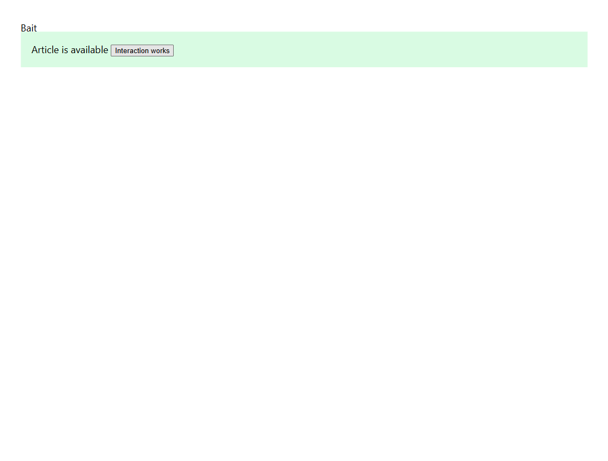

# Anti-adblock: nghiên cứu, sửa lỗi và kiểm chứng trên Chrome

Ngày rà soát: **8 tháng 9 năm 2026**. Mốc mã trước thay đổi: `490289f328d70c140bc12127c541fe9efd71915e`.

Đợt này cải thiện khả năng vô hiệu hóa cơ chế phát hiện trình chặn quảng cáo bằng các tài nguyên uBO đã có: sửa tên redirect tương thích, chọn đúng nhánh điều kiện của bộ lọc, và bảo toàn ngoại lệ scriptlet. Mục tiêu là trang vẫn đọc và tương tác được khi quảng cáo bị chặn. Mốc đối chiếu là **uBlock Origin đầy đủ**, kết hợp dữ liệu AdGuard và phản hồi cộng đồng; uBlock Origin Lite không được dùng làm chuẩn chức năng.

**Kết quả:** gói 1.1.1 đã qua pipeline phát hành cục bộ, 11 ca anti-adblock native, 27 ca UI firewall và 24 ca network trên Chrome thật. Audit sáu website và đối chứng Off được ghi ở [kết quả cuối](#kết-quả-cuối-và-artifact). Đây là bằng chứng cho các thao tác đã thử, không phải xác nhận mọi website đều vượt anti-adblock.

## Nguồn nghiên cứu và cách áp dụng

uAssets tiếp nhận lỗi bộ lọc của uBO, trong đó có anti-blocker, quảng cáo được chèn lại và lỗi trang. Vì vậy, ưu tiên là sử dụng đúng các bộ lọc đang được duy trì và sửa lỗi thực thi của fork. Phạm vi anti-blocker này không đồng nghĩa vượt paywall. [Chính sách uAssets tại mốc khảo sát](https://github.com/uBlockOrigin/uAssets/blob/49142fec8bf9c5aa89f35120e4add320757e5474/README.md).

| Nguồn chính | Phiên bản được cố định | Vai trò |
| --- | --- | --- |
| [uAssets quick-fixes](https://github.com/uBlockOrigin/uAssets/blob/49142fec8bf9c5aa89f35120e4add320757e5474/filters/quick-fixes.txt) | `49142fec8bf9c5aa89f35120e4add320757e5474` | Kiểm kê tên scriptlet và redirect dùng trong các bản sửa nhanh của uBO đầy đủ. |
| [AdGuard Base antiadblock](https://github.com/AdguardTeam/AdguardFilters/blob/566feb62676359ef6f30722de59dce0bcbe81211/BaseFilter/sections/antiadblock.txt) | `566feb62676359ef6f30722de59dce0bcbe81211` | Tìm tên tài nguyên thực tế đang bị bỏ sót và những primitive chưa hỗ trợ. |
| [AdGuard Popups antiadblock](https://github.com/AdguardTeam/AdguardFilters/blob/566feb62676359ef6f30722de59dce0bcbe81211/AnnoyancesFilter/Popups/sections/antiadblock.txt) | Cùng mốc AdGuard Filters ở trên | Kiểm tra thêm các mẫu anti-adblock trong bộ lọc phiền nhiễu. |
| [Bảng tương thích redirect của AdGuard Scriptlets](https://github.com/AdguardTeam/Scriptlets/blob/ceff76181358797f9ffa0c9af6640a17f7950a20/wiki/compatibility-table.md#redirects) | `ceff76181358797f9ffa0c9af6640a17f7950a20` | Xác nhận sáu tên AdGuard trỏ tới tài nguyên uBO nào trước khi bổ sung alias. |

Không tự động nhập toàn bộ danh sách hoặc engine từ các dự án trên. Kiểm kê một danh sách không có nghĩa bật danh sách đó cho người dùng. Catalog hiện có đã đưa quick-fixes vào nhóm uBO; thêm bản sao của cùng danh sách không giải quyết lỗi compiler.

Các dự án lịch sử chỉ được dùng để hiểu kỹ thuật và ca lỗi. README [Anti-Adblock Killer của Reek](https://github.com/reek/anti-adblock-killer) ghi bản 10.0 ngày 17/11/2016; điều đó không đủ để xem nó là nguồn cập nhật phù hợp cho web hiện tại. Kho [Fuck Fuckadblock](https://github.com/bogachenkove/fuckfuckadblock) đã được chủ sở hữu lưu trữ, chỉ đọc, ngày 05/05/2025. Đợt này không cài userscript hay tự đăng ký các danh sách cũ đó.

## Các lỗi đã sửa

### Tên redirect đúng, giữ nguyên tài nguyên đã đóng gói

Một số bộ lọc AdGuard gọi tên khác với tên file trong uBO. Khi tên chưa có trong registry, compiler nhập bộ lọc từ chối redirect dù tiện ích đã chứa đúng tài nguyên thay thế. Sửa tại [redirect-resources.js](../src/js/redirect-resources.js) bổ sung năm alias và sửa một khóa metadata viết sai:

| Tên trong bộ lọc | Tài nguyên uBO được dùng | Kết quả đã kiểm tra |
| --- | --- | --- |
| `amazon-apstag` | `amazon_apstag.js` | API Amazon trả tập bid rỗng và giữ các điểm gọi cần thiết. |
| `google-analytics` | `google-analytics_analytics.js` | API Analytics thay thế vẫn gọi callback hoàn tất. |
| `google-ima3-dai` | `google-ima-dai.js` | Sửa `aliases` thành khóa `alias` được compiler đọc; namespace và constructor DAI hiện có được giữ nguyên. |
| `noopcss` | `noop.css` | Stylesheet rỗng, sử dụng đúng file CSS. |
| `prebid-ads` | `prebid-ads.js` | Các biến kiểm tra quảng cáo có giá trị do tài nguyên uBO quy định. |
| `prevent-fab-3.2.0` | `nofab.js` | API FuckAdBlock/BlockAdBlock thay thế gọi nhánh không phát hiện blocker. |

Các ánh xạ trên được nêu trực tiếp trong bảng tương thích AdGuard đã cố định. Kiểm thử so sánh DNR sinh ra từ alias với tên chuẩn, cùng `extensionPath` và cùng byte của tài nguyên. Không thêm bản sao JavaScript, không đổi phần mở rộng quyết định loại tài nguyên, và không thay API bằng một đoạn mã phỏng đoán.

Compiler vẫn kiểm tra domain nguồn, domain loại trừ, loại request, bên thứ ba, ưu tiên và `$badfilter`. Ngoại lệ network thông thường tiếp tục có ưu tiên cao hơn redirect thông thường. Tên không biết, đường dẫn tùy ý, URL từ xa, `data:` và tên trusted scriptlet không được biến thành tài nguyên redirect.

`$redirect-rule` trong đường nhập thêm/cá nhân vẫn được báo không hỗ trợ. Theo ngữ nghĩa uBO, nó chỉ cung cấp redirect khi request đã bị một bộ lọc chặn khác quyết định chặn. Chuyển thẳng thành DNR redirect vô điều kiện sẽ mở rộng can thiệp; sáu alias mới không thay đổi ranh giới này. [Cú pháp redirect-rule của uBO đầy đủ](https://github.com/gorhill/uBlock/wiki/Static-filter-syntax#redirect-rule).

### Chọn đúng nhánh bộ lọc trước khi biên dịch

Nguồn tải thông thường, nguồn đã xác minh bằng digest và bộ lọc cá nhân từng đi qua các bước tiền xử lý khác nhau. Một nhánh dành cho MV2 hoặc Firefox có thể để lọt block, allow, `$badfilter` hoặc ngoại lệ scriptlet vào kết quả dành cho Chromium MV3. Ví dụ, ngoại lệ ở nhánh không hoạt động có thể vô hiệu hóa chính scriptlet anti-adblock đang cần chạy.

[compile-filters.js](../platform/mv3/extension/js/offscreen/compile-filters.js) dùng cùng môi trường và preparser uBO để chọn nhánh trước khi thu thập network/cosmetic/scriptlet/ngoại lệ. Với nguồn đi trực tiếp vào compiler (nguồn pin và cá nhân), các dòng bị bỏ giữ nguyên xuống dòng để chẩn đoán vẫn trỏ về nguồn ban đầu; nguồn tải có include được tính theo văn bản đã ghép. Digest của nguồn được xác minh trên byte gốc trước phép biến đổi. Điều kiện đang hoạt động mà compiler không hiểu làm đợt biên dịch thất bại có thông báo dòng; không tự kích hoạt cả hai nhánh.

Kiểm tra cấu trúc phải diễn ra **trước khi mở rộng include và loại nhánh**, vì bước đó có thể xóa delimiter cần cho việc phát hiện lỗi. [filter-conditional-structure.js](../platform/mv3/extension/js/offscreen/filter-conditional-structure.js) kiểm tra từng nguồn gốc: `!#else`/`!#endif` mồ côi, `!#else` lặp, `!#if` chưa đóng và độ lồng vượt 256. Nguồn include đang hoạt động được kiểm tra trước khi ghép; include thuộc nhánh không hoạt động không bị tải chỉ để kiểm tra.

Đợt cập nhật lỗi không được ghi đè generation đang hoạt động. [Revision cache](../platform/mv3/extension/js/compiled-cache.js) tăng từ 2 lên 3 để kết quả biên dịch cũ phải được dựng lại từ nguồn, tránh tiếp tục dùng output đã mất điều kiện hoặc ngoại lệ.

Rà soát bổ sung phát hiện preparser có thể ép toán hạng không biết ở đầu biểu thức thành boolean khi theo sau bởi `||` hoặc `&&`. Vì vậy, kiểm tra chỉ kết quả nhánh đã chọn là chưa đủ: validator nay kiểm tra từng toán hạng của điều kiện đang hoạt động **trước** khi preparser loại nhánh, kể cả trong include tải về. Ví dụ `unknown_platform || env_firefox` không được chọn nhánh chặn trên Chromium. Điều kiện nằm hoàn toàn trong nhánh cha đã tắt vẫn được bỏ qua; hành vi khả năng `cap_*` của uBO được giữ nguyên. Có 33 ca tích hợp bổ sung cho thứ tự toán hạng, phép AND/OR, dấu ngoặc và nhánh lồng trên cả ba đường nguồn.

### Ngoại lệ entity và frame tổ tiên

Trước sửa, nếu chỉ ngoại lệ dùng entity như `example.*` hoặc phạm vi tổ tiên `>>`, còn bộ lọc dương chỉ dùng hostname thường, metadata có thể thiếu `hasEntities`/`hasAncestors`. Mã sinh ra khi đó không kiểm tra đầy đủ ngoại lệ.

[make-scriptlets.js](../platform/mv3/extension/js/offscreen/make-scriptlets.js) nay tính các cờ này từ ngoại lệ nữa. Ngoại lệ theo entity và theo frame tổ tiên được giữ đúng phạm vi; đây không phải một allow chung cho mọi trang. Các ca hồi quy chạy mã scriptlet đã sinh và kiểm tra cả trang/frame được miễn lẫn nơi không khớp.

Phạm vi đăng ký mã với Chrome được tính riêng từ **bộ lọc dương**. Một ngoại lệ dùng entity, ancestor hoặc regex không được làm một scriptlet chỉ dành cho hostname cụ thể trở thành scriptlet chạy trên mọi website. Các cờ runtime vẫn bật để kiểm tra ngoại lệ; ca dương thực sự dùng wildcard/entity/ancestor/regex vẫn giữ phạm vi cần thiết. Điều này tránh tải và phân tích mã không cần thiết trên các trang không liên quan.

### Ngoại lệ regex vượt giới hạn Chrome

Kiểm tra worker và `isRegexSupported` trên Chrome thật phát hiện sáu ngoại lệ ảnh first-party trong nhóm uBO vượt giới hạn regex đã biên dịch. Nhánh fail-open hiện có từ chối cập nhật cả nhóm thay vì bỏ ngoại lệ và giữ bộ lọc chặn; do đó trên profile mới, quy tắc regex stock có trong gói nhưng **không được cài vào dynamic DNR**. Các test chỉ đo giao diện hoặc detector có thể bỏ sót lỗi này.

Chrome giới hạn kích thước biểu diễn đã biên dịch của mỗi regex dưới 2 KB; `memoryLimitExceeded` ở đây không có nghĩa máy thử thiếu RAM. Các phép tách nhánh tương đương đã được thử, nhưng không giải quyết được toàn bộ sáu biểu thức. [Giới hạn regex trong tài liệu Chrome](https://developer.chrome.com/docs/extensions/reference/api/declarativeNetRequest#rules-that-use-regular-expressions).

Bản sửa dùng override **chỉ cho sáu bộ lọc stock đã xác định**: hủy đúng nguồn gốc bằng `$badfilter`, thay bằng bảy ngoại lệ Chrome chấp nhận. Giữ nguyên scheme, hostname, các thành phần đường dẫn, hậu tố JPG, loại image, first-party, domain khởi tạo và ưu tiên. Chỉ nới giới hạn độ dài ở các token gây tốn bộ nhớ, vẫn giữ tập ký tự không rỗng; một biểu thức tách nhánh thư mục thành hai rule. Đây là **ngoại lệ rộng hơn có chủ đích**, có thể cho phép thêm ảnh cùng dạng đường dẫn trong phạm vi hai domain liên quan. Không mô tả nó là chuyển đổi regex tương đương hoàn toàn.

Các ngoại lệ không biết/không chuyển đổi được khác vẫn đi qua cơ chế từ chối và giữ generation cũ. Không nới quyền, không bỏ ngoại lệ rồi giữ chặn. Runner Chrome có thêm ca xác nhận ngoại lệ đóng gói được API chấp nhận, nhóm stock thực sự có rule native và worker không báo lỗi cập nhật nhóm đó. Nó đã làm gói trước sửa thất bại **10/11**, dù 10 ca chức năng cũ đều đạt.

### Bộ lọc Samplette có phạm vi rõ ràng

Sau báo cáo [uAssets #34400](https://github.com/uBlockOrigin/uAssets/issues/34400), audit ghi nhận một lần nút Random bị chặn bởi thông báo adblock trong khi Off chuyển bài được. Các lần đối chứng với danh sách mới sau đó không luôn tái hiện lỗi, nên đây không phải bằng chứng lỗi xảy ra trên mọi lần truy cập.

Thêm `samplette.io##+js(set, pwAdsForceDisabled, true)` vào phần filter nội tuyến đã có của nhóm `ublock-filters`. Scriptlet `set-constant` có sẵn giữ công tắc dành riêng cho SDK quảng cáo ở trạng thái tắt. Probe đọc trạng thái của trang cho thấy SDK và detector chuyển sang `disabled`, vòng dò bait dừng, `isPro` và `isBot` vẫn là `false`. Nó không giả tài khoản Pro hay đơn thuần che hộp thoại; Random vẫn phải chuyển URL và lịch sử bài thật. Off phải khôi phục công tắc và vòng dò gốc.

Kiểm thử mã sinh bao gồm phép gán biến sau khi scriptlet chạy, domain chính/domain con, domain không liên quan và tên gần giống, cùng ngoại lệ scriptlet thông thường. Rule dùng đường đóng gói nên không đòi hỏi bật Allow User Scripts. Không thêm bộ máy lọc, payload mới, timer toàn trang hay quyền trình duyệt.

## Kiểm kê khả năng nhận diện

Kiểm kê đọc các lời gọi không phải comment trong ba file nguồn cố định, chuẩn hóa tên bằng parser và đối chiếu registry thực tế của fork. Nó bao gồm cả nhánh điều kiện có thể không áp dụng cho Chromium MV3, và không cấp quyền trusted cho danh sách người dùng.

| Nguồn | Lời gọi scriptlet / tên khác nhau | Tên scriptlet đã có | Lời gọi redirect / tên khác nhau | Tên redirect trước → sau |
| --- | --- | --- | --- | --- |
| uAssets quick-fixes | 161 / 35 | **35/35** | 17 / 8 | **8/8 → 8/8** |
| AdGuard Base antiadblock | 1.949 / 40 | 33/40 | 370 / 17 | **12/17 → 17/17** |
| AdGuard Popups antiadblock | 426 / 34 | 29/34 | 64 / 8 | 8/8 → 8/8 |

Registry chứa 98 scriptlet có thể chèn, 193 tên/alias và 47 tài nguyên redirect chuẩn; không tìm thấy cạnh phụ thuộc scriptlet bị thiếu. Sáu thay đổi nâng tổng tên redirect từ 86 lên 92, không thêm payload.

**Tỷ lệ trên là độ bao phủ tên, không phải tỷ lệ filter thực thi thành công hay tỷ lệ website hết anti-adblock.** Domain, đối số, điều kiện nền tảng, nguồn trusted, thời điểm chèn và API trình duyệt còn quyết định kết quả. Một alias đã có không chứng minh tất cả cách dùng của nó được hỗ trợ. Chẳng hạn, file AdGuard Base đã cố định ở trên có điều kiện `ext_safari` tại dòng 2079 mà bảng ký hiệu uBO hiện tại không hiểu: nhập nguyên file đó bị từ chối và giữ generation cũ. Vì thế 17/17 tên redirect không có nghĩa nhập nguyên section AdGuard Base thành công.

AdGuard vẫn có primitive chưa được đăng ký tương ứng, chẳng hạn `prevent-element-src-loading`, `prevent-constructor` và một số `trusted-*`. Một vài tên có tài nguyên redirect tương đương nhưng chưa phải scriptlet có thể chèn. Kiểm kê còn gặp 73 quy tắc JavaScript thô trong Base và 18 trong Popups; không tự thực thi chúng. Những trường hợp này cần thiết kế và kiểm thử riêng, không thay bằng alias gần giống để tăng số đếm.

## Chi phí và hành vi fail-open

Đợt sửa không thêm engine thứ hai, dependency thực thi, quyền trình duyệt hay vòng lặp thăm dò mới trên mỗi trang. Alias dùng lại bảng metadata và file có sẵn. Kiểm tra nhánh/cấu trúc chạy khi nhập hoặc cập nhật nguồn; giới hạn lồng bảo vệ bước xử lý này. Các profile bộ nhớ đã công bố trong [báo cáo hiệu suất](PERFORMANCE-2026-09-06.md) vẫn áp dụng. Chưa có phép đo mới để khẳng định RAM hay CPU giảm bao nhiêu phần trăm.

Off vẫn phải khôi phục hành vi trang trong phạm vi đã tắt; allow, `noop` và ngoại lệ scriptlet không được đổi nghĩa để tăng mức chặn. Basic giữ hành vi được ghi trong tài liệu: bộ lọc cá nhân do người dùng chủ động bật có thể hoạt động, còn Off tắt cả phần đó. Thiếu ngữ nghĩa hoặc cập nhật nguồn lỗi phải bảo toàn generation trước, không tạo quyết định chặn phỏng đoán. [Phạm vi popup và fail-open](MV3-POPUP-PARITY.md), [ngữ nghĩa firewall và ngoại lệ](MV3-PARITY-IMPLEMENTATION-2026-09-06.md).

## Bằng chứng kiểm thử đã có

| Nhóm | Bằng chứng ở thời điểm soạn | Giới hạn |
| --- | --- | --- |
| Tài nguyên anti-adblock | **78 kiểm tra đạt**, chạy bằng Node 22; lint riêng hai file đạt. | Alias/canonical DNR, phạm vi, ưu tiên, hủy rule, từ chối target không hợp lệ và API tài nguyên chạy trong VM. Không phải 78 website. |
| Nhánh điều kiện | **162 tổ hợp đạt**: 9 điều kiện ngoài × 9 điều kiện trong × LF/CRLF. | So sánh chọn nhánh với preparser uBO và kiểm tra giữ số dòng; kèm kiểm tra đường nguồn tải, nguồn pin và cá nhân. |
| Cấu trúc sai | **12 trường hợp tích hợp đạt**: 4 dạng cấu trúc lỗi × 3 đường nguồn. | Chứng minh không lưu generation mới hay thay generation đang chạy; có ca bổ sung về include và giới hạn lồng. |
| Cấu trúc nguồn uAssets hiện tại | **12/12 nguồn gốc hợp lệ**, kiểm tra lúc `2026-09-08T07:07:20Z`. | Snapshot các nguồn catalog tải lúc đó; kiểm tra delimiter, không phải kiểm chứng mọi filter. Tập này khác ba file cố định dùng cho kiểm kê tên. |
| Override regex có phạm vi | **1.800 URL hợp lệ được giữ; 9.000 URL sai ranh giới bị loại**. | Kiểm tra hai compiler thực, hủy chính xác sáu nguồn, giữ bảy ngoại lệ thay thế và sáu ví dụ nới độ dài có chủ đích. Đây là superset an toàn cho ngoại lệ, không phải tương đương regex hoàn toàn. |
| Google Chrome với fixture HTTP cục bộ | **11/11 ca đạt trên ZIP cuối**. | Compiler, DNR và User Scripts thật, kèm kiểm tra stock thực sự được cài. Hash và kết quả ở phần dưới. |

Các ca Chrome bao gồm stock DNR khởi tạo, đối chứng không lọc, scriptlet + redirect + ngoại lệ bait, nhánh MV2/Firefox không hoạt động, Off, Basic với bộ lọc cá nhân, allow thắng redirect, alias detector, ngoại lệ entity, ngoại lệ tổ tiên, và cập nhật điều kiện không biết giữ cấu hình trước. Ca ancestor có đối chứng chứng minh scriptlet hoạt động trong frame con trước khi thêm ngoại lệ. Fixture theo dõi request tới máy chủ và khả năng đọc/tương tác với nội dung; không đưa một engine thay thế vào trang để tạo kết quả.

Lệnh kiểm thử thành phần từ thư mục gốc repository:

```powershell
node tools/test-antiadblock-resources.mjs
node tools/test-compiled-script-safety.mjs
node tools/test-offscreen-storage.mjs
node tools/test-scriptlet-exceptions.mjs
```

Hai runner Chrome nhận đúng bốn đối số đường dẫn tuyệt đối: `--extension` là thư mục gói đã dựng, `--chrome` là Chrome cài trên máy, `--playwright` là module `index.mjs` của công cụ kiểm thử, và `--output` là nơi ghi báo cáo. Ví dụ dưới đây dùng đường dẫn minh họa cần thay theo máy; runner tự tạo profile riêng. Playwright phục vụ kiểm thử, không được đưa vào extension.

```powershell
node tools/test-antiadblock-chrome.mjs --extension "C:\audit\extension" --chrome "C:\Program Files\Google\Chrome\Application\chrome.exe" --playwright "C:\audit\toolchain\node_modules\playwright\index.mjs" --output "C:\audit\results\native"
node tools/audit-adblock-sites-chrome.mjs --extension "C:\audit\extension" --chrome "C:\Program Files\Google\Chrome\Application\chrome.exe" --playwright "C:\audit\toolchain\node_modules\playwright\index.mjs" --output "C:\audit\results\live"
```

Runner native bật Allow User Scripts qua giao diện Chrome trong profile riêng và kiểm tra gói sao chép không đổi. Các cờ khởi chạy phục vụ tự động hóa và tải gói để thử; chúng không gỡ hạn mức MV3. Audit website là phép quan sát ngoài `npm test`, bởi dịch vụ trực tiếp và mạng có thể khiến một trang chưa đủ dữ liệu để kết luận.

## Cách đánh giá website thực tế

Audit dùng Chrome thật, hai profile sạch cho **Off** và **Complete**, cùng gói/danh sách đóng gói, không thêm filter riêng cho trang chấm điểm và không giả response mạng. Thu thập lỗi request, ảnh trang và tương tác giới hạn; không đăng nhập. Mỗi trang có ngân sách thời gian và giới hạn request, trang vượt ngân sách được ghi là chưa kết luận.

Điểm số detector chỉ là một quan sát. Một thảo luận tại [Privacy Guides Community](https://discuss.privacyguides.net/t/adblock-dns-blocklist-testing/18077) chỉ ra việc chuyển request tới noop/tài nguyên trung hòa có thể bị trang chấm điểm hiểu là request quảng cáo đã tải, dù đó chính là cách tránh lỗi trang và anti-adblock. Đây là phản hồi cộng đồng về phương pháp đo, không phải chứng nhận cho fork. Kết luận cần xem request gốc có đi ra mạng, nội dung có dùng được và ngoại lệ có đúng hay không.

uBO đầy đủ cũng lưu ý blocker khác có thể cản trở cơ chế vô hiệu hóa anti-blocker. Vì vậy phép đối chứng không cài thêm blocker trong cùng profile. [README uBO](https://github.com/gorhill/uBlock#all-programs).

| Trang được chọn | Lý do và thao tác cần quan sát |
| --- | --- |
| [Adblock Tester](https://adblock-tester.com/) | Detector tổng hợp; ghi điểm và chi tiết, không suy ra độ bao phủ toàn web. |
| [Turtlecute](https://adblock.turtlecute.org/) | Phép thử bổ sung; đối chiếu kết nối thất bại và tài nguyên thay thế với Off. |
| [Primavera Kitchen: Garlic Butter Lamb Chops](https://www.primaverakitchen.com/garlic-butter-lamb-chops/) | [uAssets #34372](https://github.com/uBlockOrigin/uAssets/issues/34372) là báo cáo full uBO đã đóng với trạng thái không tái hiện được. Dùng làm ca hồi quy, không gọi là lỗi đang tồn tại. Quan sát bài/công thức và overlay. |
| [UploadVR](https://www.uploadvr.com/) | [uAssets #34373](https://github.com/uBlockOrigin/uAssets/issues/34373) dẫn tới báo cáo trùng về detection. Quan sát bài viết và thông báo cản nội dung sau tải. |
| [Money.pl](https://www.money.pl/) | Trang thực có [lịch sử báo cáo anti-adblock](https://github.com/uBlockOrigin/uAssets/issues/12214); trạng thái cũ không chứng minh cùng lỗi xuất hiện trong lần thử này. |
| [Samplette](https://samplette.io/97436653) | [uAssets #34400](https://github.com/uBlockOrigin/uAssets/issues/34400) báo detection sau chuyển/hết bài. Thử Random khi có thể; ảnh tải đầu hoặc một lần Random không chứng minh đường tự chuyển khi bài kết thúc. |

Trang trả lỗi dịch vụ, chặn vùng, hết thời gian, lỗi media hoặc thiếu thao tác tái hiện phải ghi **chưa kết luận**, tách khỏi đạt và lỗi có thể tái hiện. Một thông báo cookie hoặc yêu cầu đăng nhập không tự được phân loại là anti-adblock.

## Kết quả cuối và artifact

Ngày 08/09/2026, **Google Chrome 152.0.7977.76** trên Windows, profile thử riêng. Mốc nguồn phát hành: [v1.1.1](https://github.com/kayurachann/uBlock-Plus/tree/v1.1.1); mốc đối chiếu trước thay đổi: v1.1.0. [JSON bằng chứng đã lược dữ liệu riêng tư](benchmarks/anti-adblock-2026-09-08.json) chứa thời gian, hash gói/cây file, từng ca và kết quả website; không chứa đường dẫn profile, toàn văn trang hoặc bình luận của người dùng website.

| Hạng mục | Kết quả |
| --- | --- |
| Toolchain theo workflow | Node **22.22.0**, npm **11.19.1**; `npm ci` đạt. |
| Test/lint/audit | **47 chương trình test**, lint đạt; `npm audit` không báo lỗ hổng dependency đã biết. |
| Standard | Build + `validate-mv3 --release` đạt; 55 ruleset, **70.192 DNR tĩnh**; ZIP **1.117 file**, 30.662.544 byte. |
| Experimental | Build + validator `--experimental-webrequest` đạt; ZIP **1.120 file**, 30.666.940 byte; launcher PowerShell 5.1 được kiểm tra. |
| Tính toàn vẹn ZIP | So sánh byte của từng entry với build và kiểm tra sidecar SHA-256 đều đạt. Chrome tải bản giải nén ZIP không sửa đổi. |
| Native anti-adblock | **11/11 đạt**. Trong 10 ca chức năng có từ trước, v1.1.0 đạt 7/10: tái hiện lỗi nhánh điều kiện, alias detector và điều kiện không biết. |
| Stock DNR khởi tạo | **172 dynamic regex rule native**, từ 251 rule nguồn sau khi Chrome loại 79 block/redirect không hỗ trợ; **828 session rule**, không có lỗi worker cập nhật stock trong lượt cuối. |
| Hồi quy chức năng khác | **27/27** UI firewall và **24/24** network Experimental, gồm có/không quyền blocking, Off, allow/noop và worker restart. |
| Samplette đóng gói | **3/3 Random mỗi chế độ Complete và Off**; không có lỗi trang/modal. Allow User Scripts tắt, không có filter cá nhân. |

Các nguồn danh sách đã được tải mới ngày 08/09 sau khi chuyển cache trước đó sang thư mục lưu riêng. Hai gói cuối dùng lại cùng **55 input đã tải trong đợt này**, cộng các override có trong mã nguồn. [Digest và thời điểm input](benchmarks/anti-adblock-filter-inputs-2026-09-08.json). Không tải lại mọi danh sách ở mỗi lần nén ZIP; build độc lập dùng nguồn trực tuyến mới có thể khác byte.

| Artifact | SHA-256 |
| --- | --- |
| `uBlock-Plus_1.1.1.chromium.zip` | `5ee8b08e27700827a769cbbdf1af6597fbea65243562e920f01787701f303782` |
| `uBlock-Plus_1.1.1.experimental.chromium.zip` | `8c142b9fe7495ee49eba41301a4ff2a203222023b02da5c642c743b43c28fe76` |
| Cây Standard đã tải vào Chrome | `89cab53e0741e2cf16f0b7bacccbe1fe4777173acfb618301c8c9e255aeae293` |
| Cây Experimental đã tải vào Chrome | `4ca7f738354cd45b028aaac7abbae31a7988585ea877ce32e97433a2277cacca` |

Hash cây file là SHA-256 của JSON danh sách `{path, sha256}`, sắp theo path như runner; không phải hash ZIP. [Release và checksum tải về](https://github.com/kayurachann/uBlock-Plus/releases/tag/v1.1.1) dùng các ZIP cục bộ đã kiểm thử trên Chrome ở trên. [Actions](https://github.com/kayurachann/uBlock-Plus/actions/workflows/mv3-chromium.yml) kiểm tra nguồn và dựng artifact riêng; không gán hash của build độc lập đó cho ZIP đã thử cục bộ.

| Website | Off | Complete | Nội dung/tương tác và kết luận |
| --- | --- | --- | --- |
| Adblock Tester | **48/100** | **96/100**, lặp lại vẫn 96 | Điểm chụp từ DOM; lần chụp ảnh lại cũng xác nhận 96. Không quy đổi thành tỷ lệ chặn toàn web. |
| Turtlecute | **11/132** bị đánh dấu chặn | **86/132** | Off cũng có kết quả chặn; mạng/trình duyệt và bộ chấm điểm ảnh hưởng số đếm. Không gán thay đổi một vài điểm giữa các lượt cho bản sửa. |
| Primavera Kitchen | Jump to Recipe hoạt động | Jump to Recipe hoạt động | Công thức hiển thị sau thao tác thật. Từ chối cookie/đóng newsletter bằng nút UI khi cần; không nhầm chúng với anti-adblock. |
| UploadVR | Trang chủ hiển thị; 1.421 request | Trang chủ hiển thị; 57 request | Không thấy tường anti-adblock trong lượt quan sát; chưa kiểm tra đọc mọi bài hoặc tương tác sâu. Các thẻ nội dung/quảng bá vẫn có thể xuất hiện. |
| Money.pl | Trang chủ tải và hiện bảng quyền riêng tư | Tương tự | **Chưa kết luận khả năng đọc bài sau consent**. Không chấp nhận tracking; không tính bảng consent là anti-adblock. |
| Samplette | Random chuyển bài | Random chuyển bài | Probe riêng lặp **3/3 mỗi chế độ**: Complete dừng detector polling, Off khôi phục; Pro/Bot vẫn false. Chưa thử tự chuyển khi bài kết thúc tự nhiên. |

Số request là quan sát trong cửa sổ thời gian thử, không phải benchmark CPU/RAM hay phần trăm tiết kiệm tài nguyên. Lỗi Samplette ban đầu không tái hiện ổn định với danh sách mới; bằng chứng cuối chứng minh cơ chế và thao tác đã thử. `$redirect-rule` nhập thêm, một số primitive AdGuard và các giới hạn API/regex của Chrome vẫn chưa tương đương full uBO.

Lượt native đầu có timeout trước khi chạy ca nào; runner đã được sửa để chờ cấu hình lần đầu sẵn sàng trước khi bật User Scripts và restart worker. Lượt đó không được tính là đạt. Hai ảnh website của lượt audit đầu bị timeout sau khi đã lấy DOM; lượt truy cập lại dùng API chụp viewport của Chrome, không sửa nội dung hay response, đã chụp được ảnh. Các báo cáo trước sửa vẫn được giữ làm đối chứng. Một detector Kubicki được loại khỏi kết luận vì đối chứng Off gây quá nhiều request/lỗi tài nguyên; các lượt UploadVR trước từng vượt ngân sách cũng không được tính là đạt.



Ảnh 1.120 × 850 pixel chụp trực tiếp fixture do dự án tạo trên đúng ZIP cuối, ngày 08/09/2026. Dòng bait được giữ theo ngoại lệ, phần quảng cáo và thông báo detector bị loại, nội dung và nút tương tác hoạt động. Không phải mockup hay ảnh của một website chấm điểm.

Pipeline chuẩn nằm tại [.github/workflows/mv3-chromium.yml](../.github/workflows/mv3-chromium.yml). Các kiểm tra native và audit website bổ sung bằng chứng cho artifact thực tế; không thay thế pipeline và không bảo đảm mọi website, vùng địa lý hay phiên bản Chrome đều cho cùng kết quả.
