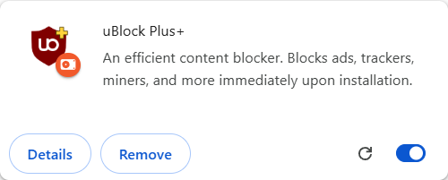

# Nhận diện uBlock Plus+

Logo của bản fork giữ khiên và chữ **uO**, thêm dấu **cộng vàng** có viền tối ở góc trên phải. Dấu cộng là dấu nhận diện sản phẩm; màu khiên thể hiện trạng thái: đỏ khi bật, xám khi tắt. Các icon loading của mã nguồn legacy vẫn có khiên vàng như trước. Logo này không biểu thị một lời hứa tương đương toàn bộ engine uBO hoặc sự bảo trợ của upstream.


Nguồn vector duy nhất: [`src/img/ublock.svg`](../src/img/ublock.svg). Script [`tools/render-product-icons.mjs`](../tools/render-product-icons.mjs) đồng bộ SVG của dashboard và xuất 19 PNG cho manifest, toolbar, README cùng các trạng thái legacy. Các kích thước MV3 là 16, 32, 64, 128 và 512 pixel; On/Off dùng cùng hình học và vị trí dấu cộng. SVG giữ hình dạng gốc và được render trực tiếp, không dùng ảnh mô phỏng hoặc ảnh AI.

Build thông thường dùng các PNG đã commit, không cần cài công cụ đồ họa. Khi chủ động sửa artwork, dùng Node cùng một bản `sharp` đã cài:

```text
node tools/render-product-icons.mjs /absolute/path/to/node_modules/sharp
```

Nếu `sharp` có thể resolve từ project, bỏ đối số đường dẫn. Bộ icon này được xuất với **sharp 0.35.4**. Kiểm tra hình ở kích thước thật, nền sáng/tối, và giữ dấu cộng vàng trong bản Off; đổi toàn bộ ảnh thành grayscale sẽ làm mất dấu nhận diện đó.

Nguồn và lịch sử của uBlock Origin cùng các thông báo bản quyền vẫn được giữ. Xem [NOTICE](../NOTICE.md) và [GPL-3.0-or-later](../LICENSE.txt).

## Kiểm tra trong Chrome

Ảnh thẻ extension thực tế trên Google Chrome 152.0.7977.76, Windows, profile thử nghiệm riêng ngày 6/9/2026:



Ảnh 500 × 202 pixel được chụp trực tiếp từ `chrome://extensions`, không chỉnh sửa. Chrome còn hiển thị biểu tượng trạng thái của chính trình duyệt trên thẻ. Dấu cộng vàng ở góc trên phải của khiên là phần thuộc artwork uBlock Plus+.

Gói thử có SHA-256 `05cdc0ac19b9676ae63f380f4bd6b0f75dc53580a214f3b28d19f7777cee497c`. Cả chín PNG MV3 được Chrome giải mã, kiểm tra kích thước, nền trong suốt, vùng dấu cộng vàng và màu khiên On/Off. Dashboard dùng đúng SVG mới. Tám tình huống branding/popup/network đạt, không page error hoặc extension console error; giữ sandbox và popup blocker tích hợp.

Hồ sơ cục bộ: `tmp/branding-2026-09-06/normal-2026-09-06T14-41-41-174Z/report.json`; ảnh trong tài liệu được sao chép nguyên byte từ `native-extension-card.png` cùng thư mục. [Tổng hợp kiểm thử và nghiên cứu](USERSCRIPTS-AND-MV3-2026-09-06.md#xác-minh-đợt-này).
