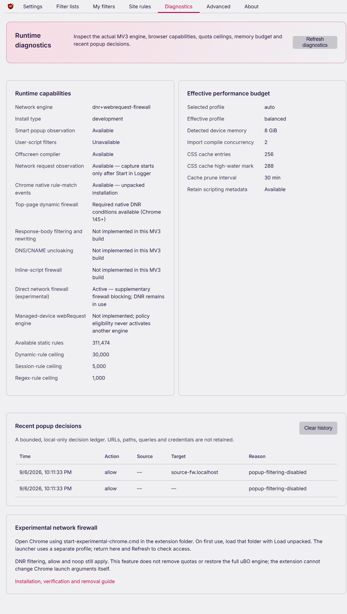
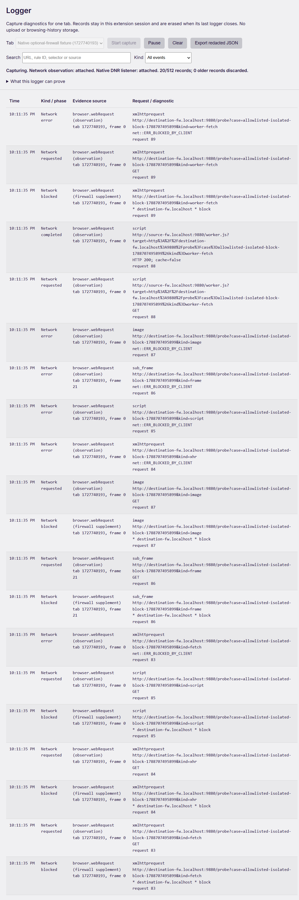

# Experimental WebRequest firewall

This optional Windows/Chromium package adds **synchronous network blocking for saved dynamic-firewall rules**. It uses the same firewall editor, hostname precedence, block/allow/noop rules and local Public Suffix List as the standard package. DNR remains active. The additional listener can evaluate a newly visited domain without waiting for DNR's learned-domain update.

This is an implemented firewall supplement, **not a port of the complete uBlock Origin network engine or an unlimited MV3 mode**. Imported, personal and packaged static network filters still use the existing DNR compiler. DNR rule and regex limits, the firewall editor's limits, response-body restrictions and unsupported inline-script filtering still apply. Compare against [the full uBO compatibility matrix](FEATURE-MATRIX.md).

<details>
<summary>Actual Chrome diagnostics and native blocking evidence</summary>





Captured from the validated experimental package in Google Chrome 152.0.7977.76 on 6 September 2026. The logger capture temporarily removes only the existing firewall's DNR rules to isolate the new API, then restores them; normal operation retains DNR. All URLs are synthetic local fixtures. [Image provenance](assets/readme/README.md).

</details>

## Install on Windows

1. Obtain the `uBlock-Plus-experimental-webrequest-<commit>` artifact from a successful [Actions run](https://github.com/kayurachann/uBlock-Plus/actions/workflows/mv3-chromium.yml), or build it with the commands below. This is a separate artifact from the standard edition. A Git push does not update GitHub Releases.
2. Extract the outer Actions archive, verify the extension ZIP against its accompanying SHA-256 file, then extract `uBlock-Plus_<version>.experimental.chromium.zip` into a permanent short path, such as `C:\Extensions\uBlockPlusExperimental`.
3. Double-click the included `start-experimental-chrome.cmd` from that folder. It runs the accompanying PowerShell launcher, which validates the package identity and opens a dedicated local Chrome profile with the extension ID allowlisted. The wrapper permits only this PowerShell process to run the script; it does not change saved Windows execution policy, the registry, Chrome enterprise policies, shortcuts or your existing Chrome profile.
4. In that Chrome window, enable Developer mode at `chrome://extensions`, choose **Load unpacked**, and select the directory containing `manifest.json`. Loading is required once; reuse the launcher for subsequent sessions. Branded Chrome no longer supports the old `--load-extension` installation switch. [Chrome team announcement](https://groups.google.com/a/chromium.org/g/chromium-extensions/c/1-g8EFx2BBY)
5. Open the extension dashboard → **Diagnostics** → **Refresh**. The network engine should show `dnr+webrequest-firewall` and the direct firewall should be active. Configure rules under **Site rules → Dynamic firewall**. With no firewall rules, the supplement has nothing to block.

The extension cannot add arguments to an already running Chrome process. The launcher is the required external step; there is no dashboard button that can grant this permission itself. Native Messaging would still require installing/registering an external host first. [Chrome Native Messaging](https://developer.chrome.com/docs/extensions/develop/concepts/native-messaging)

Close the dedicated profile's Chrome windows before changing how that profile is launched. If Chrome reuses an existing process, new arguments may not take effect. Use Diagnostics to check the grant rather than assuming the command line was applied. Chrome can remove or change experimental switches; this route is not a Chrome Web Store installation method.

## Cài đặt nhanh bằng tiếng Việt

Giải nén gói **experimental.chromium.zip**, bấm đúp **start-experimental-chrome.cmd**, rồi bật Developer mode và **Load unpacked** thư mục extension trong cửa sổ Chrome vừa mở. Launcher dùng profile riêng. Những lần sau vẫn mở bằng launcher đó.

Trong dashboard, vào **Chẩn đoán → Làm mới**: chỉ khi có quyền thực tế và trạng thái firewall sẵn sàng mới hiển thị `dnr+webrequest-firewall`. Nhập quy tắc ở **Quy tắc trang → Firewall động**. Nếu chưa có quyền, chỉ DNR hoạt động; extension không tự bật flag hoặc sửa policy. Gói này bổ sung chặn mạng trực tiếp, không gỡ mọi giới hạn MV3.

## Build and validate

From the repository root, with Node.js 22 and npm 11:

```powershell
npm ci
npm test
npm run lint
.\tools\make-mv3.ps1 -Platform chromium -Version 1.0.0 -ExperimentalWebRequest
node tools/validate-mv3.mjs dist/build/uBlockPlus.experimental.chromium --release --experimental-webrequest
```

Outputs:

- Unpacked: `dist/build/uBlockPlus.experimental.chromium`
- ZIP: `dist/build/uBlock-Plus_1.0.0.experimental.chromium.zip`
- Checksum: the ZIP path plus `.sha256`

The build transforms the generated manifest only for this variant: required `webRequest`/`webRequestBlocking`, a stable public key/ID and a distinctive name. Only the public identity is stored; it is not a signing credential or authenticity guarantee. The ordinary source manifest still excludes `webRequestBlocking`. The validator rejects privileged packages by default and requires the explicit variant option, matching identity/metadata and required implementation files. Standard and experimental outputs are separate.

To inspect the launcher without starting Chrome:

```powershell
.\dist\build\uBlockPlus.experimental.chromium\start-experimental-chrome.ps1 -PrintCommand
```

## Behavior and fallback

The listener registers synchronously when the service worker loads and returns ordinary objects, never Promises. It becomes ready only after the required permissions, saved firewall, filtering modes, Public Suffix List and tab context are available. Startup and filtering changes temporarily suspend the supplement. Unknown context, errors and absent permissions return no blocking decision. Existing native DNR rules continue to operate; fail-open means this additional layer does not invent a block while uncertain.

After worker sleep, the supplement rebuilds current document identities from Chrome's frame API, with four concurrent queries, at most 256 existing tabs and a two-second startup budget. Each tab retains at most 256 child-frame records. Navigation/removal invalidates pending recovery for that tab, and child navigation discards its old descendant identities. Unknown or evicted contexts remain fail-open until observed again; requests during cold startup may pass. Domain-learning updates alone retain the valid policy snapshot, so they do not unnecessarily suspend the supplement while DNR updates.

Only a matching firewall **block** returns `cancel: true`. `allow` and `noop` are terminal decisions in the firewall matcher but do not cancel requests. Existing DNR rules retain their own semantics: a webRequest `cancel: false` cannot reverse a DNR block. Off takes precedence. This supplement excludes main-frame navigation, requests outside tabs, restricted browser/extension URLs and contexts it cannot establish reliably. It does not inject code into Chrome settings pages.

Permission detection matters: our Chrome probe observed `addListener(..., ['blocking'])` returning normally without an actual grant, while no blocking events reached the listener. The implementation checks the granted permissions as well as registration and readiness; API namespace presence alone is insufficient.

Blocking decisions are sent to the existing bounded logger only when capture is active. Runtime tab context stays in memory; no new browsing-history database, telemetry or native service is installed. See [Privacy](PRIVACY.md).

## Update, stop and remove

Keep the extracted directory stable when updating, then reload the unpacked extension. The experimental identity is separate from the standard edition, so transfer wanted settings with the existing backup/restore controls. Avoid running both editions in the same profile, which can duplicate filtering.

To stop using the supplement, close its dedicated Chrome windows and use your usual Chrome profile. To remove it, use **Remove** at `chrome://extensions` in the dedicated profile. The profile is stored under `%LOCALAPPDATA%\uBlockPlus\ExperimentalChrome\fokcgioblkdjdajdeifgfjgmnejmgggg`; it can be deleted manually after Chrome has closed if no data there is needed. No system policy or registry cleanup is required.

## Browser evidence and remaining work

The capability probe on **Google Chrome 152.0.7977.76** compared the same tiny test extension with and without `--allowlisted-extension-id`. Without the switch, all seven request classes reached a real local HTTP server; with the switch and blocking enabled, all seven were canceled. Turning the test listener off restored traffic. The classes were fetch, XHR, parser image, subframe document, Worker script, Worker fetch and main-frame navigation. This probe demonstrates the browser permission, not the production supplement's scope: production intentionally excludes main-frame blocking. Reports remain under `tmp/managed-probe-2026-09-06/` locally.

Chrome's supported MV3 `webRequestBlocking` route remains policy-installed extensions. The allowlist route is an experimental startup switch; it does not turn the extension into a policy installation. In particular, Chromium checks policy location separately for Promise-based blocking responses. [Chrome webRequest](https://developer.chrome.com/docs/extensions/reference/api/webRequest#permissions), [Chromium 152 implementation](https://github.com/chromium/chromium/blob/152.0.7977.76/extensions/renderer/api/web_request_natives.cc#L83).

A full native uBO engine would additionally need one coherent compiled corpus for every enabled stock/imported/personal source, cross-source exceptions and `$badfilter`, request modifiers, startup recovery and engine-switch rollback. The [r58Playz/uBlock-mv3 project](https://github.com/r58Playz/uBlock-mv3#how-it-works) demonstrates that broader architecture; this package does not silently adopt its startup cancellation/reload behavior.

## Validation of the integrated package — 6 September 2026

The release pipeline passed with **Node 22.22.0 / npm 11.19.1**: `npm ci`, **43 test programs**, lint, standard and experimental Chromium builds, both release validators and verification of every ZIP entry. The Windows PowerShell 5.1 launcher dry-run also passed. An existing development dependency advisory was resolved by updating `@humanfs/node` to 0.16.8 and its required dependencies; `npm audit` reports zero known vulnerabilities. [Upstream advisory](https://github.com/advisories/GHSA-p498-v437-472g).

| Local artifact | ZIP files | Bytes | SHA-256 |
| --- | ---: | ---: | --- |
| `uBlock-Plus_1.0.0.chromium.zip` | 1,114 | 31,087,576 | `ff4e4951339aaca86b7d852e85aca010ba3a770db087e6951650b6c994075ef5` |
| `uBlock-Plus_1.0.0.experimental.chromium.zip` | 1,117 | 31,091,973 | `46f50d8cab4eb2a7d52f4c65d5ae44ba27e384aae0c60d48855c7fcae7d3b3bc` |

**24/24 native scenarios passed on installed Chrome 152.0.7977.76**, twelve with the allowlist and twelve without it. Coverage includes actual permission/status, real traffic baseline, ordinary DNR fallback, isolated supplementary blocking, Off, allow/noop, noop retaining a personal static rule, a fresh top-domain party rule, tabless requests, temporary-rule recovery after worker termination, and rehydrating an existing page after worker restart without navigating that page. Six tested subresource paths were fetch, XHR, image, script, iframe and Worker fetch. Requests and responses came from a real local HTTP server; no Playwright routing or CDP response replacement was used. Sandbox and browser popup protection stayed enabled. User Scripts permission was not enabled in this network suite; it does not retest scriptlet parity.

The actual loaded experimental copy contains **1,118 files**, including the build-only `log.txt` excluded from the ZIP. Its tree SHA-256 is `f1e2d8ac8f142546228c723667bc5450a27f3006bc1e6d52712e292fc5df173e`. Every one of the 1,117 ZIP entries matched that copy byte-for-byte. Local reports:

- Pipeline and archive receipts: `tmp/managed-probe-2026-09-06/final-pipeline.json` and `final-package-verification.json`.
- Native report, screenshots and archive proof: `tmp/managed-native-2026-09-06/2026-09-06T15-11-10-717Z/`.
- Reusable native harness: `tools/test-webrequest-firewall-chrome.mjs`; it requires explicit absolute `--extension`, `--chrome`, `--playwright` (Playwright Core's `index.mjs`) and `--output` paths, and creates short isolated temporary extension/profile paths on Windows. It is deliberately separate from `npm test` and CI's browser-free checks.

These hashes identify local artifacts. A successful CI build uses independent filter-list inputs/cache and can have a different ZIP hash. Earlier exploratory native runs are retained separately and are not included in the final 24 scenarios. No personal Chrome profile or enterprise policy was changed.
