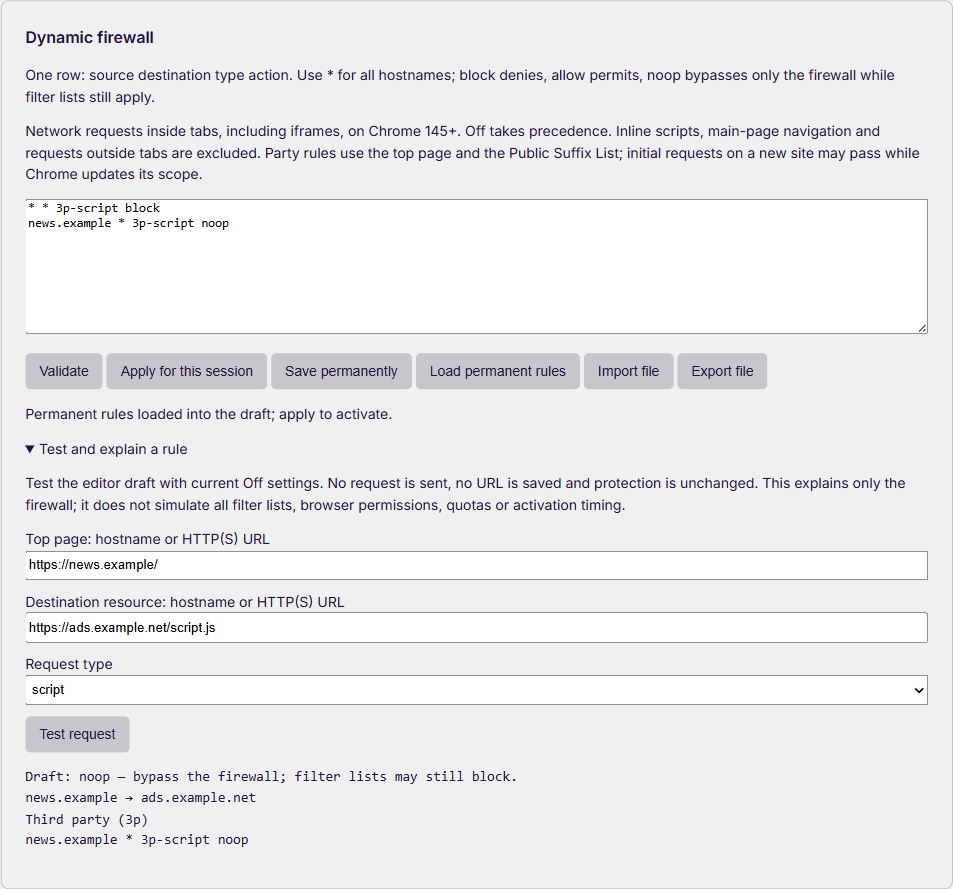

# GitHub upgrade review — 6 September 2026

Useful upgrades remain possible while keeping uBlock Plus+ practical on modest hardware. This review uses **full uBlock Origin**, AdGuard, Ghostery, Brave and ClearURLs as engineering references. It is a targeted review of relevant repositories, code and feedback, not a claim to have examined all of GitHub or to provide complete MV2 behavior on Chrome MV3.

The existing baseline is commit `2841e236e6e59cf681e8abf0efc68048ea9214d6`. It already includes a bounded opt-in logger with redacted export, temporary/permanent firewall rules, per-site Off, compiled filter generations, imported-list diagnostics and Low-memory mode. See the [feature matrix](FEATURE-MATRIX.md) and [measured performance review](PERFORMANCE-2026-09-06.md). Those capabilities should be extended rather than duplicated with a second always-running engine.

## What to build next

The order below favors useful tools that do no work until requested. Costs are design estimates, not benchmark results.

| Priority | Upgrade and user benefit | Current status and implementation boundary | Resource cost and MV3 feasibility |
| --- | --- | --- | --- |
| 1 | **Explain a firewall decision before applying a rule.** Enter the top-page URL, destination and resource type; show the winning draft cell, first/third-party relationship and Off override. | **Implemented and locally validated** in both packages. This is a local policy simulation, not an observed network decision, a DNR quota preview or a complete static-filter tester. | Runs only after Test; reuses the parser, PSL and indexed precedence. No new observation permission, per-page content script, dependency or request-result cache. Measurements below. |
| 2 | **Explain a native match with its original list and source line.** Help diagnose breakage without disabling whole lists. | Proposed extension to the existing logger, which already resolves bounded native-rule summaries. Full source mapping across merged rules and generations remains incomplete. | Load a small source-map shard on demand, bound concurrent lookups and release it when the logger closes. Show unresolved mappings honestly. A future hypothetical DNR tester must respect Chrome's unpacked-only API boundary. |
| 3 | **Temporary exception with Preview and Undo from the logger.** Test a narrowly scoped repair for one tab/resource without leaving a permanent broad allow rule behind. | Proposed; current session firewall editing is already available, but a logger-to-exception workflow is not. | Use bounded session DNR metadata and explicit scope. Account for the shared dynamic/session regex pool. Preserve `noop` as fall-through; do not relabel an allow as noop. Test tab closure, worker restart, browser restart and failed rollback. |
| 4 | **Optional URL cleaning for SPA navigation.** Remove supported tracking parameters when a site updates its address with the History API and makes no network request. | Proposed; the current imported-filter parser supports a subset of network `$removeparam`, not a complete SPA cleaner. | Medium implementation risk. Prefer explicit opt-in and domain-scoped rules; no global DOM polling. Respect Off and exceptions, keep history state and back/forward navigation intact, and fail open on unsupported semantics. Post-event address cleanup cannot undo information already read or sent by the site. |
| 5 | **A shareable troubleshooting report and clearer import review.** Show rejected/deferred filters, version, API capability and resource budgets in one report; show changed rules before an imported-list update. | Proposed extension. Existing logger export removes credentials, queries, fragments and free text but retains URL paths. Compiler reason codes and generation rollback already exist. | Generate only on request. Default a new support report to no browsing URLs; offer explicit domain-only context when needed. No automatic upload. Stream/bound diffs instead of keeping old and new large lists in multiple UI copies. |
| 6 | **Compatibility and responsiveness release gates.** Catch cold-start stalls, rapid-navigation leaks, missing cosmetics and scriptlet ordering failures before publication. | Proposed expansion of the existing real-Chrome and differential tests. This is a quality capability, not an extra background monitor on the user's machine. | No production runtime cost. Test native CSS where equivalent, packaged scriptlets and their exceptions, popup responsiveness, worker eviction and retained heap after repeated navigation. Physical 2–4 GiB testing remains necessary before hardware-wide claims. |

## Delivered: draft testing and indexed firewall

Open **Dashboard → Site rules → Dynamic firewall → Test and explain a rule**. Enter a draft, the top page, destination resource and request type, then press **Test request**. Applying or saving the draft remains a separate action. The URL fields use only normalized hostnames; paths, queries and fragments do not participate in dynamic hostname-cell matching and are not saved by this tool.

For example, with `* * 3p-script block` and `news.example * 3p-script noop`, a script from `ads.example.net` on `news.example` returns the specific `noop` cell. That means static filter lists still decide; it is not a guarantee that the resource loads. Off overrides the draft. An unavailable mode or party context produces an unknown/fail-open result. Changing inputs invalidates a pending response; importing or loading another draft clears the earlier explanation.



The same indexed evaluator now serves DNR compilation, the Experimental synchronous supplement and the tester. Indexes contain at most 256 copied, immutable cells and private Maps; no cache grows with visited URLs. The old scan/sort evaluator remains as a test/benchmark reference. A one-character source-hostname bug was also fixed: a specific `a` cell now precedes `*`, as full uBO requires, regardless of row order.

### Measurements and verification

The seeded Node **22.22.0**, Windows x64 microbenchmark alternates old/new measurement order for **9 samples of 102,400 lookups** at each cell count. It checks matching results before timing. Medians:

| Firewall cells | Scan/sort reference | Indexed lookup |
| --- | --- | --- |
| 1 | 10.26 ms | 7.46 ms |
| 16 | 31.48 ms | 12.72 ms |
| 64 | 101.07 ms | 16.29 ms |
| 256 | 405.68 ms | 15.01 ms |

The largest case is about 27× faster **for this isolated matcher workload**. These are not page-load, total CPU, Chrome RAM or weak-PC measurements. The timed loop excludes index construction; the separate one-off 256-cell construction sample was 0.092 ms. Results have no timing threshold in correctness CI. Run `node tools/benchmark-firewall-index.mjs`; [all samples and the seed](benchmarks/firewall-index-2026-09-06.json) are committed.

- **46 source test programs pass**, including 292,578 comparisons with the reference matcher, 146,289 action/provenance comparisons with the full uBO engine and the existing 10,500 DNR/full-uBO comparisons. Tests cover 256 cells, hostname/IP/IDN scope, immutable snapshots, Off, noop and mutation recovery.
- **27 native tester checks pass on installed Google Chrome 152.0.7977.76**: actual dashboard controls, stale success/error responses, PSL private domains, input rejection, import/revert, unchanged filtering settings/native DNR and content-script access denial. The local HTTP server observes zero requests during draft tests; a separate positive control confirms the counter works.
- Invalid inputs can add generic errors to the existing diagnostic console. That console is excluded from the unchanged-configuration assertion; the native test confirms it contains none of the entered URLs, credentials or query markers.
- **24 Experimental native network checks pass**, across ordinary and allowlisted Chrome, including first requests, Off, allow/noop, DNR fallback, tabless fail-open and worker stop/wake with context restoration.
- `npm ci`, `npm test`, `npm run lint`, both builds, both release validators, dependency audit and PowerShell 5.1 launcher dry run pass. All ZIP entries match the unpacked build. No dependency was added.

| Package | Verified ZIP entries | Local ZIP SHA256 |
| --- | --- | --- |
| Standard | 1,116 | `54e885ceeec5664a3475bb64c188123f15690067c98d70893f97d048779849f4` |
| Experimental | 1,119 | `b7e6e3885927ab83ec5deae2e95a36127e6fce4d9eba94146a399176e63bc25b` |

Native commands use absolute paths and a locally installed Playwright Core:

```powershell
node tools/test-firewall-tester-chrome.mjs --extension 'C:\path\to\standard' --chrome 'C:\Program Files\Google\Chrome\Application\chrome.exe' --playwright 'C:\path\to\playwright-core\index.mjs' --output 'C:\path\to\tester-report'
node tools/test-webrequest-firewall-chrome.mjs --extension 'C:\path\to\experimental' --chrome 'C:\Program Files\Google\Chrome\Application\chrome.exe' --playwright 'C:\path\to\playwright-core\index.mjs' --output 'C:\path\to\network-report'
```

The native tests use short isolated profiles and normal Chrome sandbox, web security and popup protection. They do not change the personal profile or browser policy. Private working reports are under `tmp/github-upgrades-2026-09-06/`; [public verification data](benchmarks/firewall-upgrades-native-2026-09-06.json) retains fixture results and loaded-tree hashes without local filesystem paths. The current [CI workflow](https://github.com/kayurachann/uBlock-Plus/actions/workflows/mv3-chromium.yml) checks each pushed commit independently.

## Evidence behind the choices

### Full uBlock Origin: explain decisions and preserve precedence

The [full uBO logger guide](https://github.com/gorhill/uBlock/wiki/The-logger) documents filtering details and temporary exceptions. Its [dynamic firewall source](https://github.com/gorhill/uBlock/blob/master/src/js/dynamic-net-filtering.js) provides the relevant precedence reference. The design lesson is to reuse one authoritative evaluator for enforcement and explanation; a separate UI approximation can show a different answer from the real policy. A draft result still cannot account for a later static rule, another extension or missing browser context.

The [uBO filter-performance guide](https://github.com/gorhill/uBlock/wiki/Filter-Performance) favors targeted matching and browser-native selectors when semantics agree. This supports indexing the small dynamic firewall and validating native CSS opportunities, not disabling user-selected filters. These are maintained code/documentation sources, not unresolved bug reports.

### Ghostery: return the matching reason; measure correctness with speed

The [Ghostery engine API](https://github.com/ghostery/adblocker/blob/master/packages/adblocker/README.md) exposes the matched filter and exception, separates individual-rule tooling from the indexed engine, and supports serialized engine reuse. These are useful interface and testing patterns; importing the whole engine would duplicate machinery already present here.

The [cross-engine benchmark discussion #2114](https://github.com/ghostery/adblocker/discussions/2114), started by uBO's author, demonstrates that identical lists can produce different match counts. It is a discussion, not a current open defect. Therefore a faster benchmark must also retain expected block/allow/noop decisions on a documented common subset.

[Ghostery extension #3175](https://github.com/ghostery/ghostery-extension/issues/3175) described delayed cosmetics and an unresponsive popup during Chrome cold starts. GitHub marks it completed, closed **22 June 2026**. It supplies a useful heavy-page/cold-start regression scenario; it does not establish that uBlock Plus+ has the same defect.

### AdGuard: SPA cleaning, diagnostics and careful memory ownership

[tsurlfilter #188](https://github.com/AdguardTeam/tsurlfilter/issues/188) requested `$removeparam` evaluation for `pushState`/`replaceState` URLs. It was completed **4 June 2026**; the [TSWebExtension 5.0.0 changelog](https://github.com/AdguardTeam/tsurlfilter/blob/master/packages/tswebextension/CHANGELOG.md) records SPA integration on **28 July 2026**. The same release exposes conversion errors to callers and corrects a previous metadata-unloading strategy because subsequent configuration could otherwise receive empty metadata. The lesson is to make unsupported rules visible and release data only when it can be reconstructed correctly.

[AdGuard #3537](https://github.com/AdguardTeam/AdguardBrowserExtension/issues/3537), intermittent missing cosmetics/scriptlets in MV3 after rapid navigation, was completed **15 June 2026**. [AdGuard #3547](https://github.com/AdguardTeam/AdguardBrowserExtension/issues/3547), out-of-memory during repeated refreshes, was completed **4 June 2026** and is labeled MV2 upstream. Neither is evidence of a reproduced leak here; both inform lifecycle tests.

The [Scriptlets repository](https://github.com/AdguardTeam/Scriptlets) and its [compatibility table](https://github.com/AdguardTeam/Scriptlets/blob/master/wiki/compatibility-table.md) are references for comparing argument semantics and fixtures. Similar names do not establish equivalent behavior. Any adopted scriptlet must be reviewed, licensed appropriately, bundled at build time and tested with stock/imported/personal exceptions. No remote executable module is proposed.

### ClearURLs: useful cleanup needs a per-site escape hatch

The [ClearURLs History API listener](https://github.com/ClearURLs/Addon/blob/master/core_js/historyListener.js) observes history changes and cleans the updated URL. Its current source uses an older injection API and rewrites history state; it is an architectural reference, not code to copy directly into this MV3 extension.

[ClearURLs #509](https://github.com/ClearURLs/Addon/issues/509), requesting a per-domain disable option when cleaning breaks a workflow, remains **open** as checked on 6 September 2026. An implementation here should inherit the existing per-site Off control and test login, checkout, signed links, repeated parameters, fragments, history state and back/forward behavior.

### Brave: use a reference engine in tests before adding another runtime

[Brave's adblock-rust](https://github.com/brave/adblock-rust/blob/master/README.md) supports native/Wasm builds, uBO-compatible resources and optional features such as CSS validation and external domain resolution. This makes it useful as a build-time or development-only comparison target. It does not grant an MV3 extension native browser privileges. A production Wasm/native engine would need separate startup, memory, semantics, license and permission evidence before adoption.

## Conditions for accepting an upgrade

1. Show a concrete user benefit and distinguish planned, implemented and validated behavior.
2. Preserve Off, allow/noop, exceptions and last-known-good filtering state. Unknown context or unsupported semantics must not become approximate blocking.
3. Keep diagnostics and tools on demand. Add no default browsing-history upload or always-on scanning merely to obtain more features.
4. Test functional equivalence before comparing timings. Record browser version, list set, cold/warm state, sample count and peak versus retained memory separately.
5. Respect actual API support. Chrome's [`testMatchOutcome`](https://developer.chrome.com/docs/extensions/reference/api/declarativeNetRequest#method-testMatchOutcome) is for unpacked extensions; a local draft evaluator must not masquerade as this native result. No new engine, userscript or flag is a universal MV3 bypass.

## Tóm tắt tiếng Việt

Đợt này **đã thêm công cụ thử bản nháp firewall**, bảng tra dùng chung cho biên dịch/chặn/thử quy tắc, và sửa thứ tự ưu tiên hostname nguồn một ký tự. Vào **Site rules → Firewall động → Thử và giải thích quy tắc**. Kết quả cho biết ô thắng, 1p/3p và Off; không gửi request, không lưu URL hay tự áp dụng bản nháp. `noop` vẫn để danh sách lọc quyết định.

46 chương trình test, 27 kiểm tra UI trên Chrome thật và 24 kiểm tra network đều đạt. Benchmark riêng với 256 ô giảm khoảng 406 xuống 15 ms cho 102.400 lượt tra; không suy diễn thành tốc độ trang hoặc mức giảm RAM Chrome. Giải thích nguồn chặn đầy đủ, ngoại lệ tạm có Undo, làm sạch URL SPA và báo cáo hỗ trợ tốt hơn vẫn là đề xuất tiếp theo trong bảng, chưa được quảng cáo là đã có.
