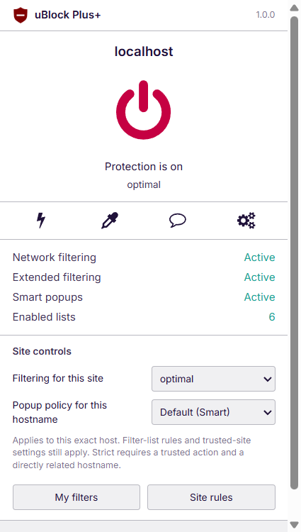
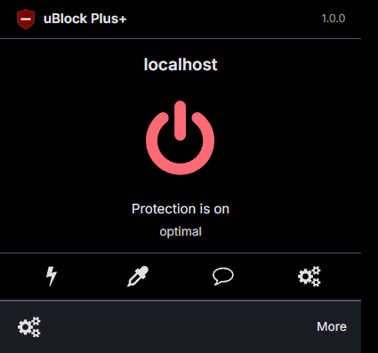
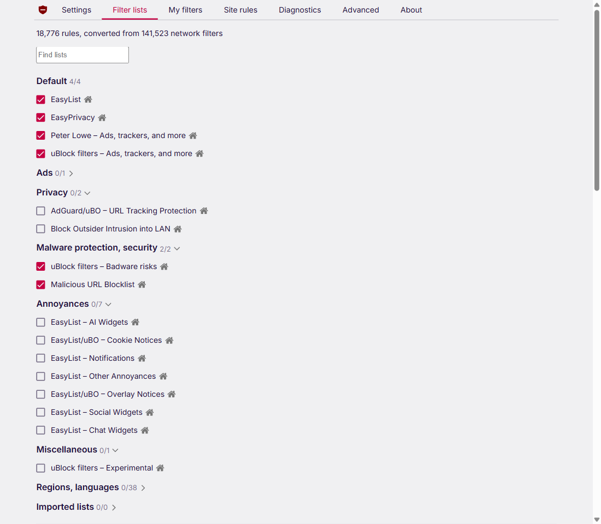
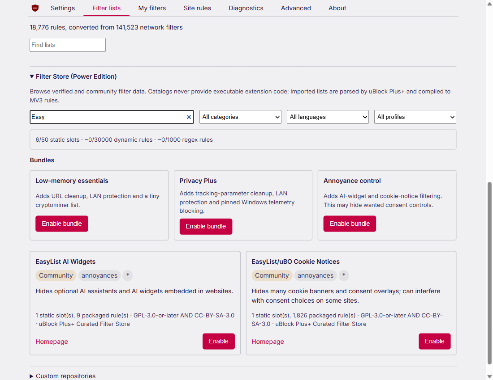
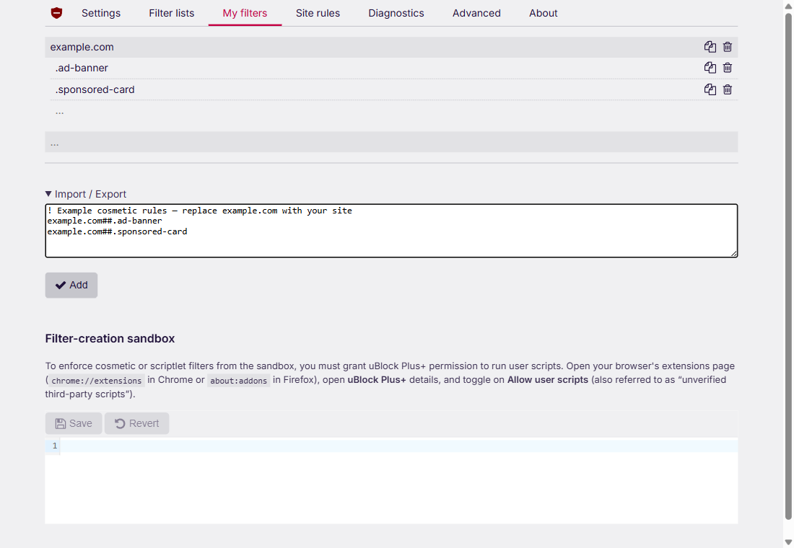
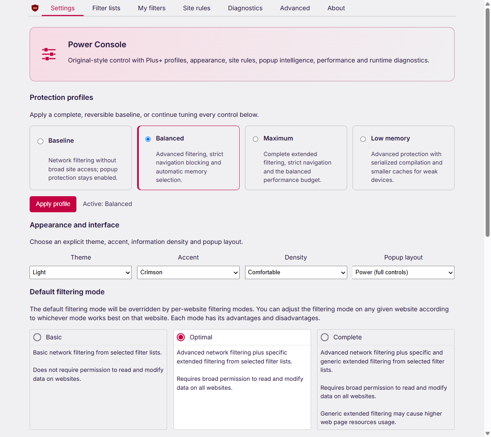

<div align="center">


# uBlock Plus+

**Trình chặn nội dung cộng đồng dành cho Chromium Manifest V3**

[](https://github.com/kayurachann/uBlock-Plus/actions/workflows/mv3-chromium.yml) [](https://github.com/kayurachann/uBlock-Plus/releases) [](#quick-start) [](../LICENSE.txt)

[English](../README.md) · [Deutsch](README.de.md) · [Español](README.es.md) · [Français](README.fr.md) · [日本語](README.ja.md) · [한국어](README.ko.md) · [Русский](README.ru.md) · [**Tiếng Việt**](README.vi.md) · [简体中文](README.zh_CN.md) · [繁體中文](README.zh_TW.md)

[Bản phát hành](https://github.com/kayurachann/uBlock-Plus/releases) · [Cài đặt](#quick-start) · [Hướng dẫn sử dụng](#sử-dụng-popup) · [Tài liệu](README.md) · [Báo lỗi](https://github.com/kayurachann/uBlock-Plus/issues/new/choose)

</div>

uBlock Plus+ chặn các yêu cầu mạng và thành phần trang không mong muốn bằng cơ chế lọc khai báo của Chromium, bộ lọc giao diện và các scriptlet đóng gói sẵn. Dự án phát triển từ bộ lọc và các thành phần MV3 của [uBlock Origin](https://github.com/gorhill/uBlock), bổ sung nút bật/tắt quen thuộc cho từng trang, bộ lọc cá nhân, Filter Store cộng đồng và khả năng sao lưu/khôi phục cục bộ.

> [!IMPORTANT]
> Đây là một bản fork cộng đồng độc lập, không phải bản phát hành chính thức của uBlock Origin hay [uBlock Origin Lite](https://github.com/uBlockOrigin/uBOL-home) và không được Raymond Hill bảo trợ. Dự án hiện được phân phối dưới dạng **bản thử nghiệm cài đặt thủ công**. MV3 chịu các giới hạn của trình duyệt; dự án không tuyên bố tương đương hoàn toàn với MV2. Bản thử nghiệm đã phát hành có thể khác mã nguồn mới nhất—xem [nên cài bản nào](#nên-cài-bản-nào).

## Mục lục

- [Tính năng và hình ảnh](#tính-năng-và-hình-ảnh)
- [Cài đặt, cập nhật và gỡ bỏ](#quick-start)
- [Sử dụng popup](#sử-dụng-popup)
- [Danh sách lọc và bộ lọc cá nhân](#danh-sách-lọc-và-bộ-lọc-cá-nhân)
- [Cài đặt và sao lưu](#cài-đặt-và-sao-lưu)
- [Quyền truy cập và quyền riêng tư](#quyền-truy-cập-và-quyền-riêng-tư)
- [Những gì MV3 làm được và chưa làm được](#những-gì-mv3-làm-được-và-chưa-làm-được)
- [Build và kiểm tra bản đóng gói](#build-và-kiểm-tra-bản-đóng-gói)
- [Khắc phục sự cố](#khắc-phục-sự-cố)
- [Tài liệu và đóng góp](#tài-liệu-và-đóng-góp)
- [Ghi công và giấy phép](#ghi-công-và-giấy-phép)

## Tính năng và hình ảnh

| Nhóm tính năng | Khả năng hiện có của bản fork |
| --- | --- |
| Lọc mạng | Danh sách DNR tĩnh đóng gói sẵn, các quy tắc nhập vào/tùy chỉnh được hỗ trợ, ngoại lệ và tài nguyên chuyển hướng đóng gói sẵn. |
| Lọc nội dung trang | Bộ lọc giao diện riêng cho từng trang và dùng chung, các bộ lọc thủ tục được hỗ trợ và scriptlet đóng gói sẵn. |
| Điều khiển theo trang | Bật/tắt bảo vệ và nhớ mức lọc trước đó, các chế độ Basic/Optimal/Complete và chính sách popup theo tên máy chủ. |
| Công cụ phần tử | Picker tạo bộ lọc giao diện lâu dài, zapper xóa tạm thời và unpicker gỡ bộ lọc cá nhân đã lưu phù hợp với phần tử được chọn. |
| Quản lý bộ lọc | Danh sách tích hợp, nhập qua HTTPS, các gói Filter Store và catalog cộng đồng tương thích. |
| Cài đặt | Cấu hình bảo vệ có sẵn, giao diện, mật độ hiển thị, cấu hình bộ nhớ, tùy chọn riêng tư của trình duyệt và sao lưu/khôi phục. |
| Chẩn đoán | Chẩn đoán cục bộ với dung lượng giới hạn và các ràng buộc của MV3; không phải nhật ký đầy đủ của mọi yêu cầu mạng theo thời gian thực. |

Các ảnh dưới đây chụp **tiện ích thực tế được nạp dạng unpacked trong Google Chrome 152.0.7977.76 trên Windows** vào ngày 6 tháng 9 năm 2026. Ảnh sử dụng hồ sơ thử nghiệm riêng và trang minh họa; đây không phải bản thiết kế mô phỏng. Ngôn ngữ giao diện trong ảnh là tiếng Anh. [Thông tin nguồn ảnh](assets/readme/README.md).

<p align="center">

<br><strong>Điều khiển theo trang</strong><br>Nút bật/tắt, mức lọc và công cụ trong cùng một popup. Cuộn xuống để tới các nút phía dưới khi mở rộng chi tiết.
</p>

<details>
<summary><strong>Xem giao diện tối với phần chi tiết thu gọn</strong></summary>

<p align="center">

<br><strong>Thu gọn chi tiết</strong><br>Giao diện tối với phần chi tiết thu gọn. More/Less thay đổi lượng thông tin hiển thị; mật độ hiển thị là một cài đặt giao diện riêng.
</p>

</details>

<a id="quick-start"></a>

## Bắt đầu nhanh

### Nên cài bản nào

Manifest khai báo yêu cầu **Chromium 130 trở lên**. Lần kiểm thử trình duyệt thực tế gần nhất được ghi nhận dùng Google Chrome 152; kết quả đó không chứng nhận mọi biến thể hoặc phiên bản Chromium. Quy trình phát hành của repository này tạo gói Chromium MV3, không tạo gói Firefox hay Safari.

Tại thời điểm kiểm tra **ngày 6 tháng 9 năm 2026**, [GitHub Releases](https://github.com/kayurachann/uBlock-Plus/releases) cung cấp **bản thử nghiệm v1.0.0 phát hành ngày 1 tháng 9**. Gói ZIP đó có trước các bản sửa popup và đợt kiểm thử Chrome được mô tả trong README này. Để có những thay đổi đó, **hãy build từ mã nguồn hiện tại hoặc dùng gói đầu ra của một lần chạy Actions thành công** cho tới khi có bản phát hành mới. Huy hiệu CI hiển thị trạng thái hiện tại của workflow; việc một commit được đẩy lên không tự có nghĩa là đã tạo được gói đầu ra.

Để lấy bản build CI, mở [MV3 Chromium Actions](https://github.com/kayurachann/uBlock-Plus/actions/workflows/mv3-chromium.yml), chọn lần chạy thành công ứng với commit muốn dùng và tải artifact `uBlock-Plus-chromium-<commit>`. GitHub có thể yêu cầu đăng nhập. Giải nén file artifact bên ngoài trước để lấy ZIP tiện ích và checksum tương ứng. Artifact CI là bản build thử nghiệm có thời gian lưu giới hạn; chúng không tự cập nhật bản Release công khai.

### Cài bản unpacked

1. Lấy `uBlock-Plus_*.chromium.zip` và file `.sha256` tương ứng từ trang Releases của repository này, artifact của một lần chạy CI thành công hoặc [bản build từ mã nguồn](#build-và-kiểm-tra-bản-đóng-gói).
2. Kiểm tra checksum rồi giải nén ZIP vào một thư mục cố định. Trên Windows, đường dẫn ngắn như `C:\Extensions\uBlock-Plus` giúp tránh sự cố do đường dẫn quá dài.
3. Mở `chrome://extensions` trong Chrome hoặc `edge://extensions` trong Edge.
4. Bật **Developer mode/Chế độ dành cho nhà phát triển**, chọn **Load unpacked/Tải tiện ích đã giải nén**, rồi chọn thư mục chứa trực tiếp `manifest.json`. Không chọn file ZIP hoặc thư mục cha.
5. Ghim tiện ích từ trình đơn Extensions/Tiện ích của trình duyệt và mở một trang HTTP/HTTPS thông thường để thử popup.
6. Với các bộ lọc nhập vào/tập lệnh người dùng được hỗ trợ, bật khả năng chạy tập lệnh người dùng của trình duyệt khi cần. Trên Chrome 138+, mở **Details/Chi tiết → Allow User Scripts/Cho phép tập lệnh người dùng**. Chrome 130–137 sử dụng **Developer mode/Chế độ dành cho nhà phát triển**. Sau khi đổi công tắc, tải lại tiện ích để worker nhận trạng thái API mới. Xem [hướng dẫn userScripts chính thức của Chrome](https://developer.chrome.com/docs/extensions/reference/api/userScripts).

<details>
<summary><strong>Kiểm tra SHA-256 trên Windows</strong></summary>

Chạy các lệnh sau trong thư mục tải xuống, thay số phiên bản nếu cần:

```powershell
(Get-FileHash .\uBlock-Plus_1.0.0.chromium.zip -Algorithm SHA256).Hash
Get-Content .\uBlock-Plus_1.0.0.chromium.zip.sha256
```

Các giá trị thập lục phân phải trùng nhau; chữ hoa hay chữ thường không ảnh hưởng. Hãy đối chiếu với checksum đi kèm **đúng bản đóng gói đó**.

</details>

### Cập nhật hoặc gỡ bỏ

Bản cài unpacked **không tự cập nhật** qua Chrome Web Store. Xuất bản sao lưu tại **Dashboard/Bảng điều khiển → Settings/Cài đặt**, đóng các tab liên quan nếu cần, kiểm tra và giải nén bản mới, rồi thay thế nội dung trong chính thư mục tiện ích đang dùng. Giữ nguyên đường dẫn thư mục và bấm **Reload/Tải lại** trên thẻ tiện ích. Tải lại các trang web để làm mới script và bộ lọc giao diện đã được áp dụng. Không đặt bản mới vào một thư mục con bên trong bản cũ.

Để gỡ cài đặt, xuất bản sao lưu nếu muốn giữ cấu hình, rồi chọn **Remove/Xóa** trên trang quản lý tiện ích của trình duyệt. Chỉ xóa thư mục mã nguồn không gỡ tiện ích khỏi trình duyệt. Cài lại từ một thư mục khác có thể tạo mã định danh unpacked khác; hãy dùng bản sao lưu khi chuyển sang bản cài mới.

## Sử dụng popup

### Bật/tắt bảo vệ và chế độ lọc

Bấm nút nguồn lớn để tắt bảo vệ cho phạm vi tên máy chủ được hỗ trợ của trang hiện tại. Bấm lại để khôi phục mức lọc trước khi tắt. Mức này vẫn được ghi nhớ sau khi đóng popup hoặc khởi động lại service worker.

| Chế độ | Hành vi |
| --- | --- |
| Off / None — Tắt / Không có bộ lọc | Tắt lọc cho phạm vi trang đó. Tải lại trang để loại bỏ những tác động đã được áp dụng. |
| Basic — Cơ bản | Lọc mạng; ở mức này không đăng ký bộ lọc giao diện mở rộng/scriptlet từ các danh sách đóng gói sẵn. |
| Optimal — Tối ưu | Lọc mạng cùng bộ lọc giao diện riêng cho từng trang và scriptlet đóng gói sẵn. |
| Complete — Hoàn toàn | Chế độ Optimal cộng thêm bộ lọc giao diện dùng chung. |

Các mức này chọn hành vi lọc; chọn Basic **không** thu hồi quyền `<all_urls>` đã khai báo trong manifest. Mức mặc định chung được đặt trong bảng điều khiển; ngoại lệ theo trang được ưu tiên trong phạm vi hỗ trợ. Nếu không thể biểu diễn an toàn một thiết lập ghi đè cho trang con, tiện ích sẽ báo lỗi thay vì âm thầm thay đổi trang cha hoặc các trang cùng cấp.

Dùng **Reload/Tải lại** sau khi thay đổi bảo vệ. **More/Less** mở rộng hoặc thu gọn chi tiết popup; thao tác này không đổi cách lọc. Popup hỗ trợ phím Tab/Enter và đưa tiêu điểm về nút vừa thao tác sau khi thay đổi bất đồng bộ thành công. Trên trang cài đặt trình duyệt, trang tiện ích và các trang bị hạn chế khác, những công cụ không dùng được sẽ hiển thị trạng thái không khả dụng.

### Chính sách popup

Chính sách popup áp dụng cho **đúng tên máy chủ**. Chính sách này điều khiển việc xử lý popup theo ngữ cảnh, đồng thời vẫn tuân theo quy tắc danh sách lọc và thiết lập trang đáng tin cậy.

| Chính sách | Ý nghĩa |
| --- | --- |
| Default (Smart) — Mặc định (Thông minh) | Dùng chính sách xử lý theo ngữ cảnh được đặt làm mặc định. |
| Allow — Cho phép | Cho qua ở bước xét chính sách theo ngữ cảnh. **Quy tắc danh sách lọc đã biên dịch phù hợp vẫn có thể chặn.** |
| Smart — Thông minh | Xét trang mở popup, trang đích, thao tác đáng tin cậy và việc mở nhiều popup liên tiếp. Khi thiếu thông tin, ưu tiên tránh chặn nhầm. |
| Strict — Nghiêm ngặt | Yêu cầu thao tác người dùng đáng tin cậy và tên máy chủ có quan hệ trực tiếp. Cửa sổ đăng nhập hoặc thanh toán hợp lệ trên trang khác có thể cần chính sách khác. |

Tắt bảo vệ của trang được ưu tiên. Số popup gần đây tính những lần đóng thành công cho trang đang hiển thị, không phải mọi yêu cầu của trình duyệt. MV3 theo dõi bất đồng bộ, nên một trang đích có thể bắt đầu mở trước khi quy tắc phù hợp đóng nó. [Hành vi và cam kết của popup](MV3-POPUP-PARITY.md).

### Picker, zapper và unpicker

- **Picker:** chọn phần tử và tạo bộ lọc giao diện lâu dài; xem lại phần đã chọn trước khi lưu.
- **Zapper:** tạm xóa phần tử trên trang hiện tại. Phần tử sẽ xuất hiện lại khi tải lại trang.
- **Unpicker:** gỡ bộ lọc cá nhân đã lưu phù hợp với phần tử được chọn; chỉ khả dụng khi có bộ lọc cá nhân phù hợp.
- **My filters / Site rules:** mở trực tiếp mục Bộ lọc tự tạo hoặc Quy tắc trang tương ứng, kể cả khi bảng điều khiển đã mở sẵn.

## Danh sách lọc và bộ lọc cá nhân

### Danh sách tích hợp và nhập qua HTTPS

Mở **Dashboard/Bảng điều khiển → Filter lists/Danh sách bộ lọc** để xem những danh sách đang bật và thêm nguồn đăng ký HTTPS được hỗ trợ. Quá trình build đóng gói dữ liệu bộ lọc upstream thành các ruleset tĩnh. Danh sách nhập vào được tải và biên dịch cục bộ theo tập tính năng MV3 được hỗ trợ; bật thêm danh sách sẽ tiêu tốn hạn mức quy tắc của trình duyệt và có thể tạo quy tắc trùng lặp hoặc làm lỗi trang.

Bắt đầu với lựa chọn mặc định, rồi thêm danh sách theo khu vực hoặc mục đích cụ thể khi cần. Dùng URL HTTPS trực tiếp của danh sách: chuyển hướng, cấu trúc không hợp lệ, dữ liệu quá lớn hoặc không được hỗ trợ có thể bị từ chối. Một danh sách tải được không có nghĩa là mọi bộ lọc MV2 trong đó đều triển khai được. Nếu không thể kích hoạt bản thay thế an toàn, các quy tắc đang hoạt động được giữ lại ở những thao tác có cơ chế khôi phục.



### Filter Store

**Filter Store** là catalog danh sách lọc, không phải kho tiện ích hoặc kho mã thực thi. Store chứa các mục và gói cộng đồng đóng gói sẵn, đồng thời cho phép thêm tối đa tám catalog JSON tương thích qua HTTPS. URL catalog khác với URL trực tiếp của một danh sách lọc.

Xem mục đích, nguồn, giấy phép và nhãn mức độ tin cậy của từng mục trước khi bật. Nhãn `community` không có nghĩa là dự án bảo chứng; mã băm xác nhận một bản dữ liệu cụ thể, không chứng minh chất lượng bộ lọc. Catalog tùy chỉnh vẫn được xếp là mục cộng đồng. Xem [định dạng catalog và quy tắc xét duyệt](FILTER-STORE.md).



### My filters — Bộ lọc tự tạo

Mục bộ lọc giao diện tổ chức selector đã lưu theo tên máy chủ và hỗ trợ nhập/xuất văn bản. Ví dụ, một selector theo trang có thể ẩn thẻ nội dung tài trợ lặp lại:

```text
example.com##.sponsored-card
```

Đây là quy tắc minh họa, không phải danh sách được khuyến nghị. Dùng picker để chọn một phần tử thực trên trang cần lọc. Trình soạn bộ lọc người dùng riêng nhận cú pháp bộ lọc được hỗ trợ; bộ lọc dạng tập lệnh người dùng cần khả năng tương ứng của trình duyệt. Tính năng này không biến mọi cú pháp MV2 hoặc JavaScript từ xa thành nội dung có thể thực thi dưới MV3.



## Cài đặt và sao lưu

**Cấu hình bảo vệ có sẵn** và **cấu hình bộ nhớ** là hai thiết lập khác nhau:

| Thiết lập | Lựa chọn | Mục đích |
| --- | --- | --- |
| Cấu hình bảo vệ | Baseline, Balanced, Maximum, Low memory | Áp dụng một nhóm tùy chọn lọc và hoạt động. Xem lại các thiết lập sau khi đổi cấu hình. |
| Mức lọc | Basic, Optimal, Complete; Off cho ngoại lệ | Chọn cách lọc mặc định hoặc cho một trang. |
| Cấu hình bộ nhớ | Auto, Balanced, Low-memory | Điều khiển số tác vụ biên dịch đồng thời, hạn mức cache và dọn dẹp. |
| Giao diện | Chủ đề, màu nhấn, mật độ, chi tiết popup | Điều chỉnh cách hiển thị mà không đổi quy tắc đối chiếu bộ lọc. |

> [!NOTE]
> Số liệu lưu trữ đo dung lượng storage/cache của tiện ích, **không phải RAM đang dùng hoặc bộ nhớ tiến trình**. Chế độ Low-memory dùng cache có giới hạn và biên dịch tuần tự; dự án không tuyên bố một tỷ lệ giảm đã đo được hay kết quả benchmark trên thiết bị cấu hình thấp.

Vào **Dashboard/Bảng điều khiển → Settings/Cài đặt** để xuất bản sao lưu trước khi đổi bản cài hoặc đặt lại tiện ích. Khi khôi phục, tiện ích kiểm tra cấu hình được hỗ trợ, bao gồm thiết lập lọc, mức lọc đã nhớ theo trang, chính sách popup, bộ lọc cá nhân và cấu hình danh sách/catalog. Giữ file sao lưu riêng tư: chúng có thể chứa tên trang, quy tắc cá nhân và URL nguồn đăng ký.

Quá trình khôi phục diễn ra tuần tự, không phải một giao dịch chung cho toàn bộ cấu hình. Dữ liệu không hợp lệ sẽ không vượt qua bước kiểm tra, nhưng lỗi trình duyệt hoặc lưu trữ ở bước sau có thể xảy ra khi một số thiết lập trước đó đã được khôi phục. Kiểm tra kết quả hiển thị và những danh sách đang bật sau khi hoàn tất. **Reset/Đặt lại** đưa thiết lập về mặc định và xóa trạng thái danh sách đã nhập; thao tác này không thay thế việc sao lưu.



## Quyền truy cập và quyền riêng tư

Việc lọc và lưu trữ dữ liệu chẩn đoán diễn ra cục bộ. Tiện ích không tích hợp công cụ phân tích người dùng của dự án, SDK quảng cáo hay dịch vụ tải lên lịch sử duyệt web. Tiện ích có gửi yêu cầu mạng tới nhà cung cấp danh sách/catalog để lấy nguồn đã chọn; các nhà cung cấp đó có chính sách riêng tư riêng. Mở liên kết hỗ trợ/báo lỗi cũng có thể kết nối tới trang bên ngoài.

| Quyền hoặc khả năng | Mục đích sử dụng |
| --- | --- |
| `<all_urls>`, `scripting`, `activeTab` | Áp dụng bộ lọc theo trang, script đóng gói sẵn và công cụ phần tử do người dùng gọi trên các trang được hỗ trợ. |
| `declarativeNetRequest` | Yêu cầu Chrome chặn, cho phép, chuyển hướng hoặc sửa yêu cầu mạng theo các quy tắc đã khai báo. |
| `declarativeNetRequestFeedback` | Cung cấp chẩn đoán giới hạn các quy tắc đã khớp trong môi trường unpacked/gỡ lỗi được hỗ trợ. |
| `storage`, `unlimitedStorage` | Lưu cục bộ thiết lập và dữ liệu bộ lọc đã biên dịch. |
| `alarms`, `offscreen` | Lên lịch bảo trì và thực hiện tác vụ biên dịch nền tạm thời. |
| `userScripts` | Đăng ký bộ lọc người dùng/nhập vào được hỗ trợ bằng mã đóng gói sẵn, tùy thuộc công tắc riêng của Chrome. |
| `webNavigation` | Liên kết thông tin điều hướng với ngữ cảnh popup. |
| `privacy` tùy chọn | Thay đổi một số cài đặt riêng tư của Chrome sau khi người dùng bật các tùy chọn đó; khi tắt một mục, tiện ích xóa thiết lập ghi đè của mình. |

Các bản unpacked hiện tại, kể cả gói có số phiên bản, đều khai báo `declarativeNetRequestFeedback`. Chẩn đoán quy tắc đã khớp còn yêu cầu bật **Developer mode** riêng của tiện ích và có hỗ trợ từ trình duyệt; thiết lập này khác với Developer mode của Chrome dùng khi cài đặt. Bản build có số phiên bản bỏ các tài nguyên ánh xạ gỡ lỗi chi tiết, nên mức độ chi tiết của chẩn đoán có thể khác bản build dành cho phát triển. Nút xem quy tắc đã khớp không khả dụng không có nghĩa là lọc đã tắt. Chẩn đoán popup được giới hạn dung lượng và lược bỏ phần chi tiết của URL. Xem [quyền riêng tư và thời gian lưu dữ liệu](PRIVACY.md) cùng [mô hình mối đe dọa](THREAT-MODEL.md).

## Những gì MV3 làm được và chưa làm được

| Khả năng | Giới hạn hiện tại |
| --- | --- |
| Chặn mạng và ngoại lệ | Thực hiện qua DNR, trong phạm vi điều kiện và hạn mức Chrome hỗ trợ. |
| Bộ lọc giao diện và scriptlet | Hỗ trợ một tập con; mã scriptlet và tài nguyên chuyển hướng phải được đóng gói cùng tiện ích. |
| Bộ lọc popup/popunder | Tập quy tắc `$popup` đóng gói sẵn (stock) được hỗ trợ và tập con `$popup`/`$popunder` từ danh sách nhập vào chạy qua bộ quan sát theo ngữ cảnh. `$popunder` đóng gói sẵn được ghi rõ là bỏ qua khi quá trình xuất làm mất loại gốc của quy tắc. |
| Tường lửa động và nhật ký yêu cầu mạng | Không tái tạo đầy đủ tường lửa đồng bộ của MV2 hoặc nhật ký trực tiếp không giới hạn. |
| Viết lại nội dung phản hồi, kiểm tra DNS/CNAME, chặn chính xác theo kích thước phản hồi | Không có cách triển khai tương đương bằng các API MV3 công khai thông thường mà bản build này sử dụng. |
| Khả năng managed/native | Thuộc nghiên cứu và lộ trình; không có ứng dụng native companion được đóng gói hoặc âm thầm cài đặt. |

**Fail-open là lựa chọn có chủ đích.** Nếu quyết định xử lý popup cần ngữ cảnh còn thiếu, không thể biểu diễn ngoại lệ an toàn hoặc đã dùng hết hạn mức đối chiếu, quyết định liên quan sẽ được hoãn thay vì chặn gần đúng. Điều kiện cho phép chưa thể xử lý có thể buộc hoãn quyết định; chúng không được tạo ra quyết định cho phép/chặn gần đúng. Quy tắc hạn chế chưa được hỗ trợ không bị mở rộng bằng cách bỏ bớt điều kiện. Cách xử lý này giảm chặn nhầm, đồng thời có nghĩa là một số popup không mong muốn vẫn có thể lọt qua.

Cài sideload không xóa hạn mức DNR, khôi phục trang nền MV2 chạy liên tục hoặc vượt qua bảo mật của trình duyệt. Chromium, các tiện ích chặn khác và chính trang đích cũng có thể ảnh hưởng tới kết quả. Xem [bảng tương thích](FEATURE-MATRIX.md), [kiến trúc](ARCHITECTURE.md) và [Power Runtime](POWER-RUNTIME.md) để biết ranh giới cụ thể.

## Build và kiểm tra bản đóng gói

Cần Git với submodule, Node.js, npm và kết nối mạng để lấy dữ liệu bộ lọc khi build. Workflow phát hành trên Windows cố định **Node 22.22.0 và npm 11.19.1**. Package khai báo Node 22+ và npm 11+; hãy dùng đúng phiên bản cố định để tái lập môi trường CI.

### Windows / PowerShell

```powershell
git clone --recurse-submodules https://github.com/kayurachann/uBlock-Plus.git
cd uBlock-Plus
git submodule update --init --recursive

npm ci
npm test
npm run lint
$version = (Get-Content -Raw package.json | ConvertFrom-Json).version
.\tools\make-mv3.ps1 -Platform chromium -Version $version
node tools/validate-mv3.mjs dist/build/uBlockPlus.chromium --release
```

Nạp thư mục `dist/build/uBlockPlus.chromium` từ trang quản lý tiện ích của trình duyệt. Lệnh có số phiên bản cũng tạo `dist/build/uBlock-Plus_<version>.chromium.zip` và file `.sha256` đi kèm. Thư mục build chứa `manifest.json`; thư mục gốc của repository không phải bản có thể cài trực tiếp.

<details>
<summary><strong>Cách build trên Linux / macOS</strong></summary>

Dùng môi trường shell có các công cụ mà [script build MV3](../platform/mv3/README.md) yêu cầu, bao gồm Bash, make, jq và tiện ích ZIP/checksum. Quy trình phát hành cùng bằng chứng kiểm thử Chrome thực tế được dẫn ở đây đã chạy trên Windows.

```bash
git clone --recurse-submodules https://github.com/kayurachann/uBlock-Plus.git
cd uBlock-Plus
npm ci
npm test
npm run lint
VERSION=$(node -p "require('./package.json').version")
tools/make-mv3.sh chromium "$VERSION"
node tools/validate-mv3.mjs dist/build/uBlockPlus.chromium --release
```

Có thể dùng `make mv3-chromium` để tạo thư mục unpacked. Truyền số phiên bản cho script sẽ tạo thêm ZIP có phiên bản và checksum.

</details>

### Những gì đã được kiểm thử

Đợt [kiểm tra phát hành cục bộ ngày 6 tháng 9 năm 2026](MV3-CHROME-RETEST-2026-09-06.md) ghi nhận:

- **31 chương trình kiểm thử mã nguồn**, lint, build có phiên bản và kiểm tra gói đầu ra đều đạt.
- **28 tình huống trong cửa sổ Google Chrome thật**, bao gồm điều khiển popup, yêu cầu mạng thực khi bật/tắt bảo vệ, IPv4/IPv6, công cụ phần tử, phạm vi trang, nhập danh sách, sao lưu/đặt lại và khởi động lại worker.
- **7 tình huống Chrome bổ sung** với sandbox và trình chặn popup tích hợp được bật, bao gồm chặn/chuyển hướng thực tế trên trang công khai.
- **976 mục trong ZIP** khớp với thư mục build; 55 ruleset và 70.163 quy tắc DNR trong đúng gói được kiểm tra đó.

Đây là kết quả cục bộ có thời điểm cụ thể cho bản build được ghi nhận, không khẳng định gói ZIP cũ đã phát hành hoặc mọi commit sau này đều vượt qua các bước này. Thao tác từ chối hộp thoại quyền tùy chọn của trình duyệt chưa được thử vì bản cài kiểm thử đã có `<all_urls>`. Các tình huống được dựng để kiểm thử cùng một phép thử trên trang công khai không bảo đảm kết quả cho mọi website, trình duyệt hoặc công nghệ hỗ trợ. Xem riêng [các lần chạy Actions](https://github.com/kayurachann/uBlock-Plus/actions/workflows/mv3-chromium.yml) để biết trạng thái CI.

## Khắc phục sự cố

| Triệu chứng | Cách kiểm tra |
| --- | --- |
| Chrome không nạp được tiện ích | Giải nén ZIP, chọn thư mục chứa `manifest.json`, kiểm tra phiên bản trình duyệt và đọc lỗi trên thẻ tiện ích. |
| Một website hoạt động sai | Tắt bảo vệ cho trang đó rồi tải lại. Nếu trang hoạt động bình thường, kiểm tra bộ lọc cá nhân và danh sách mới bật, sau đó báo lỗi kèm cách tái hiện. |
| Popup đăng nhập/thanh toán bị đóng | Kiểm tra chính sách của đúng tên máy chủ và các quy tắc lọc đã biên dịch. Allow chỉ đổi chính sách theo ngữ cảnh; tạm tắt bảo vệ trang là bước chẩn đoán riêng. |
| Picker hoặc thay đổi giao diện có vẻ không hoạt động | Thử trên trang web thông thường, kiểm tra chế độ lọc và khả năng chạy tập lệnh người dùng, rồi tải lại trang. Không thể chèn script vào các trang trình duyệt bị hạn chế. |
| Không nhập được danh sách | Kiểm tra URL HTTPS trực tiếp, định dạng, kích thước, khả năng của trình duyệt và hạn mức DNR còn lại. Đọc thông báo lỗi trước khi thử lại. |
| Thiết lập cho trang con bị từ chối | Kiểm tra phạm vi trang cha trong Site rules; tiện ích từ chối thiết lập ghi đè chưa được hỗ trợ thay vì mở rộng tác động của nó. |
| `Internal error while updating dynamic rules` khi kiểm thử trên Windows | Thử lại trong hồ sơ riêng có đường dẫn ngắn. Sự cố môi trường này đã tái hiện trong đợt kiểm thử Chrome thực tế; không xóa hồ sơ cá nhân để xử lý lỗi. |
| Không có chẩn đoán quy tắc đã khớp | Kiểm tra Developer mode riêng của tiện ích và khả năng hỗ trợ API gỡ lỗi của trình duyệt. Các thiết lập này khác công tắc cài đặt của Chrome; bộ lọc vẫn có thể đang hoạt động. |
| Popup vẫn có giao diện cũ sau cập nhật | Kiểm tra thư mục được nạp và phiên bản, tải lại tiện ích, rồi đóng và mở lại popup. Không mặc định rằng ZIP đã phát hành trước đó chứa các bản sửa mã nguồn mới hơn. |

Khi báo lỗi, ghi rõ bản build/commit của tiện ích, phiên bản trình duyệt và hệ điều hành, URL liên quan cùng các bước tái hiện, mức lọc, danh sách tùy chỉnh đang bật, kết quả mong đợi/thực tế và ảnh chụp đã che thông tin riêng tư nếu hữu ích. Thử trong hồ sơ riêng với các tiện ích chặn khác tắt để loại trừ ảnh hưởng chéo. Không đăng URL riêng tư, dữ liệu tài khoản hoặc bản sao lưu chưa được rà soát.

## Tài liệu và đóng góp

Hướng dẫn chi tiết hiện tại được duy trì bằng [tiếng Anh](../README.md) và [tiếng Việt](README.vi.md). Tám bản dịch README trước đó vẫn có trong thanh ngôn ngữ; thông báo ở đầu các bản đó dẫn tới hướng dẫn mới nhất trong thời gian chờ cập nhật đầy đủ. Giao diện tiện ích có đủ chuỗi Power trong mười ngôn ngữ được duy trì, với chuỗi tiếng Anh thay thế khi build cho các ngôn ngữ đóng gói còn lại. Mức độ dịch giao diện và độ cập nhật của README là hai việc riêng.

| Tài liệu | Nội dung |
| --- | --- |
| [Mục lục tài liệu](README.md) | Tài liệu cho người dùng, nhà phát triển và cộng đồng. |
| [Bảng tương thích](FEATURE-MATRIX.md) / [Điều khiển popup](MV3-POPUP-PARITY.md) | Hành vi được hỗ trợ và giới hạn tương thích. |
| [Filter Store](FILTER-STORE.md) | Định dạng catalog, mức độ tin cậy và quy trình gửi đề xuất. |
| [Kiến trúc](ARCHITECTURE.md) / [Power Runtime](POWER-RUNTIME.md) | Biên dịch, hạn mức quy tắc, hoạt động và trạng thái lưu bền vững. |
| [Quyền riêng tư](PRIVACY.md) / [Mô hình mối đe dọa](THREAT-MODEL.md) | Dữ liệu, quyền truy cập và ranh giới tin cậy. |
| [So sánh với upstream](MV3-RETEST-2026-09-05.md) / [Nghiên cứu cộng đồng](COMMUNITY-RESEARCH.md) | Nguồn dẫn có thời điểm và so sánh kiểm thử hồi quy. |
| [Lộ trình](ROADMAP.md) / [Quản trị](COMMUNITY-GOVERNANCE.md) | Công việc dự kiến, quy trình xét duyệt và trách nhiệm. |

Dùng [biểu mẫu issue của bản fork này](https://github.com/kayurachann/uBlock-Plus/issues/new/choose) để báo lỗi và đề xuất tính năng, hoặc [gửi một mục Filter Store](https://github.com/kayurachann/uBlock-Plus/issues/new?template=filter_store_submission.yml). Đọc [CONTRIBUTING.md](../CONTRIBUTING.md) trước khi đóng góp mã nguồn, bộ lọc hoặc bản dịch. Không mặc định rằng lỗi riêng của bản fork cần được báo lên trình theo dõi issue của dự án upstream.

Báo lỗ hổng bảo mật qua [biểu mẫu advisory riêng tư](https://github.com/kayurachann/uBlock-Plus/security/advisories/new) của repository, theo hướng dẫn [SECURITY.md](../SECURITY.md). Các mục trên lộ trình, bao gồm nghiên cứu managed/native, không phải cam kết về tính năng đã phát hành hoặc ngày phát hành.

## Ghi công và giấy phép

Dựa trên [uBlock Origin](https://github.com/gorhill/uBlock) của Raymond Hill và cộng đồng đóng góp, bao gồm các thành phần MV3 kế thừa từ upstream. Cảm ơn tác giả và người duy trì [uAssets](https://github.com/uBlockOrigin/uAssets), [dự án uBlock Origin Lite](https://github.com/uBlockOrigin/uBOL-home), các danh sách lọc, bản dịch và thư viện bên thứ ba được đóng gói cùng tiện ích. Tên và liên kết dùng để ghi nhận đúng dự án; chúng không hàm ý các dự án đó bảo trợ bản fork này.

Lịch sử upstream, phần đầu file ghi bản quyền và thông báo bên thứ ba được giữ nguyên. Xem [NOTICE.md](../NOTICE.md) để biết thông tin ghi công. uBlock Plus+ được phân phối theo [GNU General Public License, phiên bản 3 hoặc mới hơn](../LICENSE.txt).
